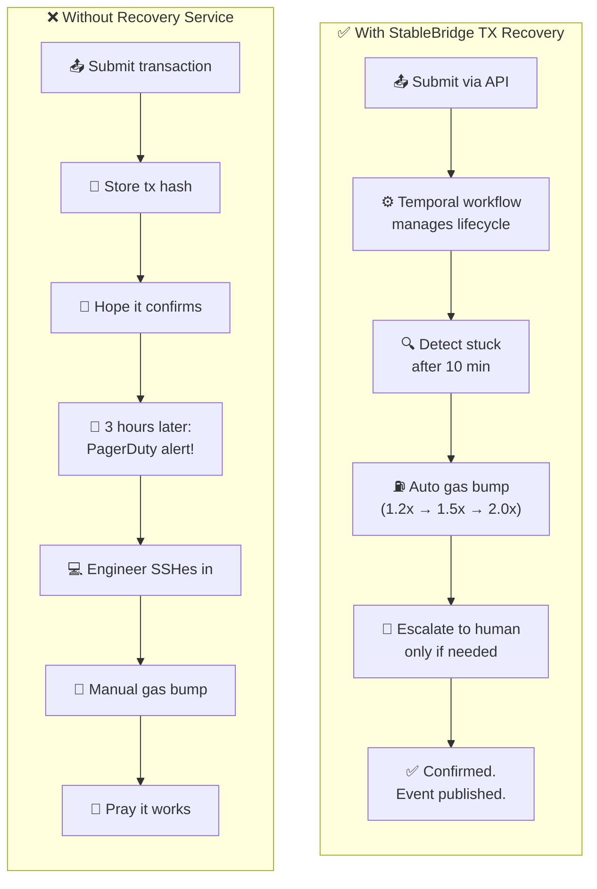
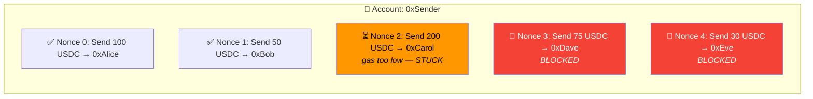
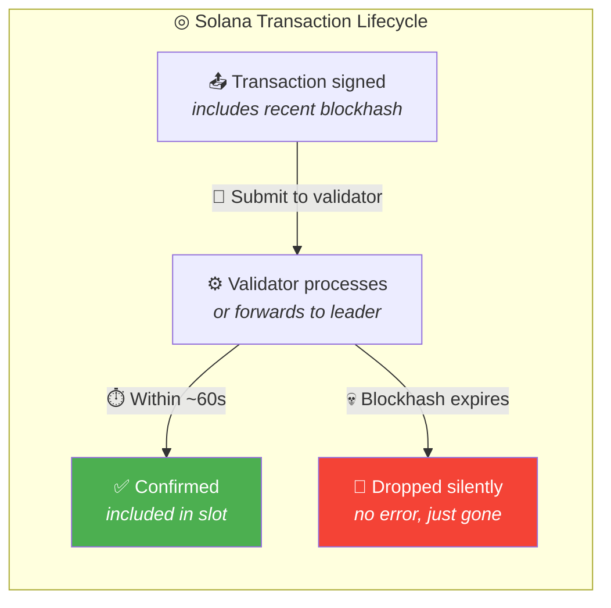
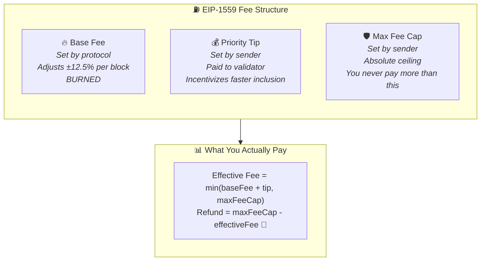
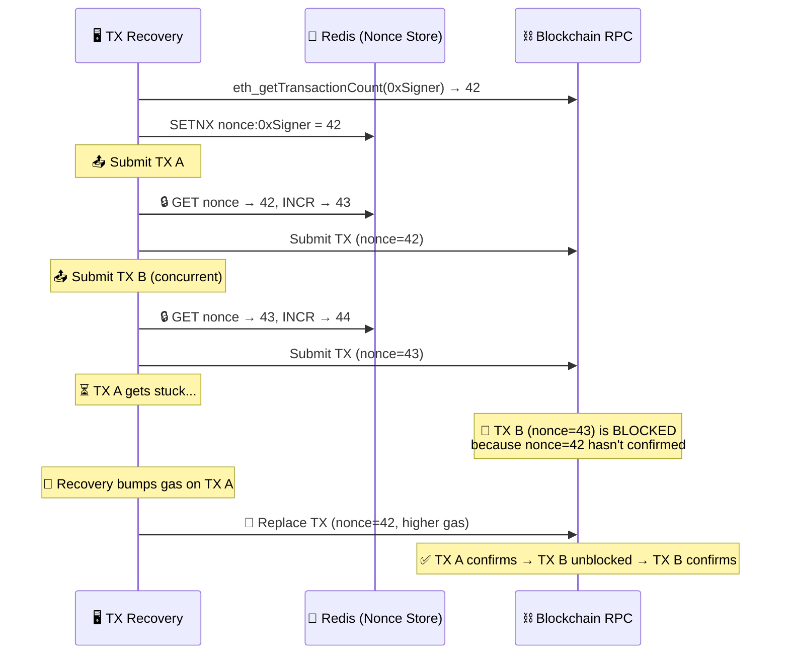
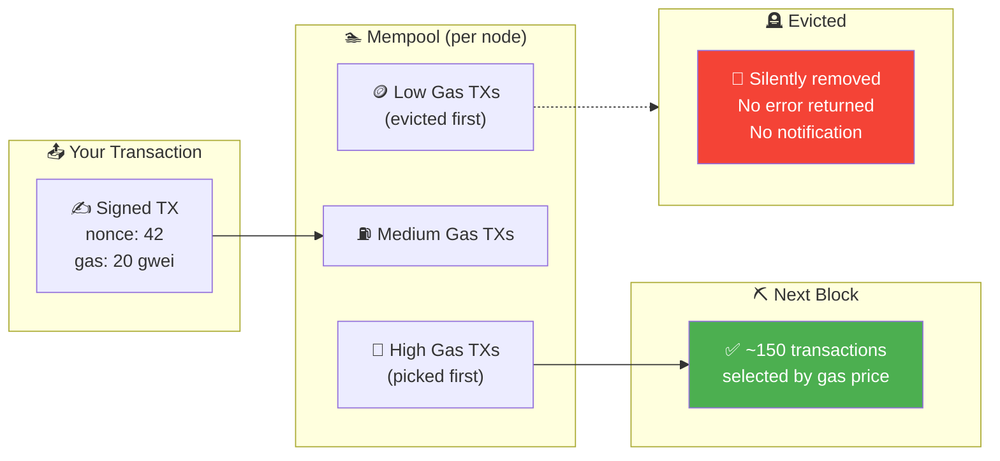
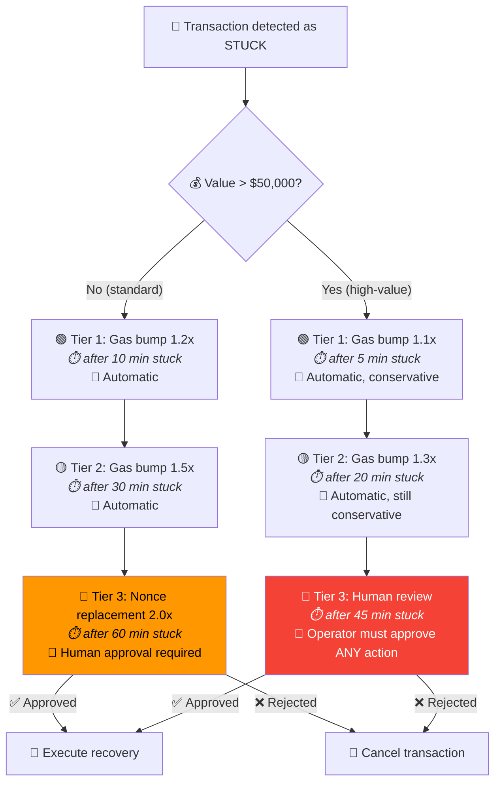
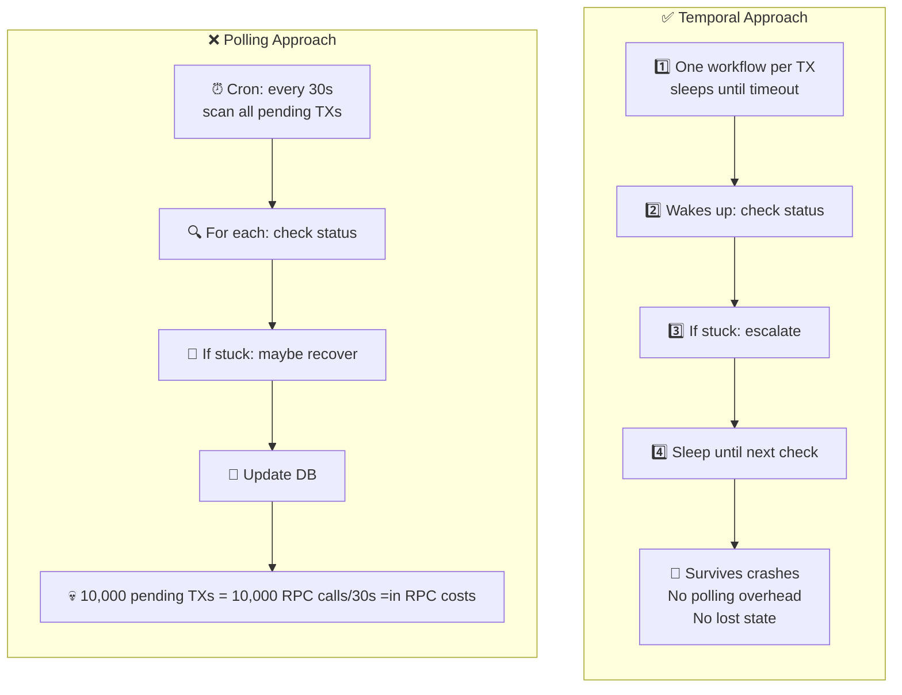
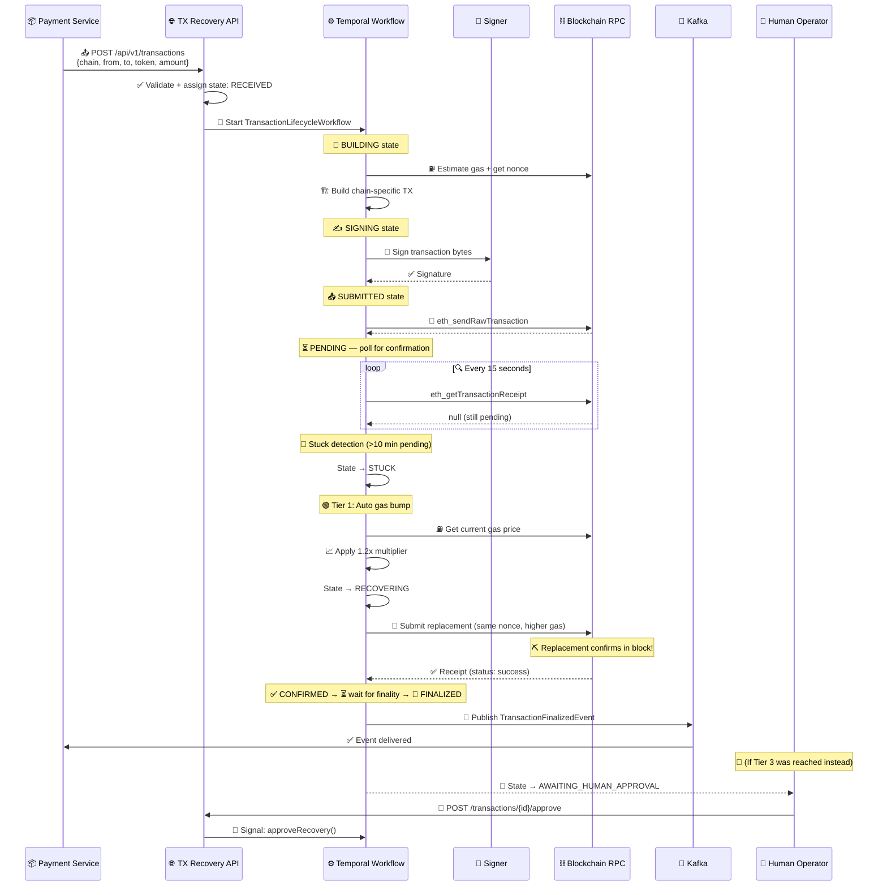

<div align="center">


[](https://deepwiki.com/Puneethkumarck/stablebridge-tx-recovery)

# StableBridge Transaction Recovery

**Enterprise-grade microservice for stablecoin transaction recovery across EVM and Solana chains.** Detects stuck or failed on-chain transactions and orchestrates automated recovery with configurable escalation tiers, gas management, and human-approval workflows.

[Why Transaction Recovery?](#why-do-blockchain-transactions-fail) | [Understanding the Chains](#understanding-recovery-across-chains) | [Architecture](#architecture) | [Quick Start](#getting-started) | [API Reference](#api-reference) | [Configuration](#configuration-reference)

</div>

---

## The Problem

Blockchain transactions fail silently. A submitted stablecoin transfer can get stuck in the mempool for hours — and there's no built-in mechanism to detect this, let alone fix it.

## The Solution

StableBridge TX Recovery manages the **entire transaction lifecycle** from submission to finality. It detects stuck transactions, applies tiered gas-escalation strategies, and routes high-value decisions to human operators — all orchestrated through crash-proof Temporal workflows.

## The Result

A fully automated, multi-chain transaction lifecycle manager that turns "funds stuck for 6 hours, engineer on-call paged" into "automatic recovery in 10 minutes, zero human intervention for 95% of cases."

<div align="center">

| Metric | Value |
|--------|-------|
| **Chains** | EVM (Ethereum, Base, Polygon) + Solana |
| **Recovery** | Tiered: gas bump → nonce replace → human approval |
| **Durability** | Temporal workflows survive crashes + restarts |
| **Delivery** | At-least-once (transactional outbox + Kafka) |
| **Signing** | Pluggable: local keystore or remote HMAC callback |
| **Escalation** | Separate tiers for standard vs. high-value (>$50K) |

</div>

---

## Table of Contents

- [Why Do Blockchain Transactions Fail?](#why-do-blockchain-transactions-fail)
  - [The Naive Approach (and Why It Fails)](#the-naive-approach-and-why-it-fails)
  - [What Transaction Recovery Replaces](#what-transaction-recovery-replaces)
- [Understanding Recovery Across Chains](#understanding-recovery-across-chains)
  - [EVM Chains (Ethereum, Base, Polygon)](#evm-chains-ethereum-base-polygon)
  - [Solana](#solana)
- [Gas Economics: Why Transactions Get Stuck](#gas-economics-why-transactions-get-stuck)
  - [EIP-1559 and the Fee Market](#eip-1559-and-the-fee-market)
  - [Solana Priority Fees](#solana-priority-fees)
- [Nonce Management: The Hidden Complexity](#nonce-management-the-hidden-complexity)
- [The Mempool: Where Transactions Wait (and Die)](#the-mempool-where-transactions-wait-and-die)
- [Escalation: From Automatic to Human](#escalation-from-automatic-to-human)
- [Durable Execution: Why Temporal?](#durable-execution-why-temporal)
- [The Transaction Recovery Lifecycle](#the-transaction-recovery-lifecycle)
- [Key Features](#key-features)
- [Architecture](#architecture)
  - [System Architecture](#system-architecture)
  - [Hexagonal Layer Design](#hexagonal-layer-design)
  - [Transaction Lifecycle State Machine](#transaction-lifecycle-state-machine)
  - [Temporal Workflow Orchestration](#temporal-workflow-orchestration)
  - [Event-Driven Architecture](#event-driven-architecture)
- [Supported Chains](#supported-chains)
- [Design Patterns & Principles](#design-patterns--principles)
- [Tech Stack](#tech-stack)
- [Module Structure](#module-structure)
- [Getting Started](#getting-started)
  - [Prerequisites](#prerequisites)
  - [Quick Start](#quick-start)
  - [Make Targets](#make-targets)
- [API Reference](#api-reference)
- [Configuration Reference](#configuration-reference)
- [Resilience & Fault Tolerance](#resilience--fault-tolerance)
- [Security](#security)
- [Observability](#observability)
- [Testing Strategy](#testing-strategy)
- [CI/CD Pipeline](#cicd-pipeline)
- [Deployment](#deployment)
- [Infrastructure](#infrastructure)
- [License](#license)

---

## Why Do Blockchain Transactions Fail?

When you submit a transaction to a blockchain, it doesn't execute immediately. It enters a **mempool** — a waiting area where unconfirmed transactions sit until a validator picks them up and includes them in a block. Between submission and confirmation, many things can go wrong:

| | Failure Mode | What Happens | 💀 Severity |
|---|---|---|---|
| ⛽ | **Gas price too low** | Other transactions outbid yours. Validators pick higher-paying ones. Yours sits indefinitely | 🟠 Common — hours stuck |
| 🔢 | **Nonce gaps** | TX #5 is pending, so TX #6, #7, #8... are ALL blocked. One stuck TX = entire pipeline frozen | 🔴 Critical — cascade failure |
| 🌊 | **Network congestion** | NFT mint / token launch / market crash → gas spikes 10-100x in minutes | 🟠 Unpredictable — can't prevent |
| 📡 | **RPC node failures** | Node accepted your TX, returned a hash... then silently dropped it | 🔴 Invisible — you think it's fine |
| 🗑️ | **Mempool eviction** | Mempool is full. Lowest-fee TXs are purged. No error. No notification. Just gone | 🔴 Silent data loss |

### The Naive Approach (and Why It Fails)

> **🎬 A Day in the Life of a Stuck Transaction**

```
 🖥️  Your App       ──→  "Submit 50 USDC transfer to 0xABC"
 ⛓️  Blockchain     ──→  "Transaction hash: 0x123... submitted."
 🖥️  Your App       ──→  "Great, it's done! ✅"

                         ⏳ ... 30 minutes later ...

 🖥️  Your App       ──→  "Hmm, still pending... probably just slow."

                         ⏳ ... 2 hours later ...

 🚨  PagerDuty      ──→  "ALERT: 47 transactions stuck on Ethereum"
 😰  On-call Eng    ──→  "Let me SSH in and check..."
 💻  Terminal        ──→  $ eth_getTransactionByHash 0x123...
                          → status: pending, gas: 12 gwei
                          → current base fee: 85 gwei  😱
 😤  On-call Eng    ──→  "Gas spiked 7x. Need to replace all 47 manually."

                         ⏳ ... 45 minutes of manual nonce wrangling ...

 💸  On-call Eng    ──→  "Done. Spent $380 in gas fees. Missed 3 SLAs."
 📉  Dashboard      ──→  "Customer satisfaction: ↓ 12%"
```

Most applications treat transaction submission as **"fire and forget."** They submit, store the hash, and assume it will confirm. When it doesn't, an engineer gets paged and has to:

| Step | Manual Action | ⏱️ Time | 😫 Pain Level |
|------|--------------|---------|--------------|
| 1 | Figure out *which* transactions are stuck | ~15 min | 🟡 Tedious |
| 2 | Understand *why* — gas? nonce gap? dropped? | ~10 min | 🟠 Requires chain expertise |
| 3 | Construct replacement transactions | ~20 min | 🔴 Error-prone |
| 4 | Sign and broadcast replacements | ~5 min | 🟠 Security-sensitive |
| 5 | Monitor until replacements confirm | ~30 min | 🟡 Waiting... |
| 6 | Update internal records and notify | ~10 min | 🟡 Easy to forget |

This is error-prone, chain-specific, and doesn't scale. A single stuck transaction can block an entire nonce sequence, cascading into dozens of failed transfers.

### What Transaction Recovery Replaces



---

## Understanding Recovery Across Chains

StableBridge TX Recovery supports two fundamentally different blockchain architectures, each with its own transaction model, gas mechanism, and failure modes. Understanding these differences is essential to understanding why recovery is chain-specific.

### ⟠ EVM Chains (Ethereum, Base, Polygon)

EVM chains use an **account-based model** with sequential nonces and a fee market. Every transaction from an address has a nonce — a counter that starts at 0 and increments by 1 for each transaction.

> **🎬 The Nonce Domino Effect**

```
 🔢 Nonce 0:  Send 100 USDC → 0xAlice     ✅ Confirmed
 🔢 Nonce 1:  Send 50 USDC  → 0xBob       ✅ Confirmed
 🔢 Nonce 2:  Send 200 USDC → 0xCarol     ⏳ Stuck! (gas too low)
 🔢 Nonce 3:  Send 75 USDC  → 0xDave      🚫 Blocked (waiting for nonce 2)
 🔢 Nonce 4:  Send 30 USDC  → 0xEve       🚫 Blocked (waiting for nonce 2)
     ↑
     └── One stuck transaction = entire pipeline frozen 🧊
```



**Key concepts:**

| | Concept | What It Is | Why It Matters for Recovery |
|---|---------|-----------|----------------------------|
| 🔢 | **Nonce** | Sequential counter per address (0, 1, 2, ...) | A stuck TX blocks ALL subsequent TXs from that address |
| ⛽ | **Gas price** | Fee paid to validators per unit of computation | Too low = stuck in mempool; too high = overpaying |
| 📊 | **EIP-1559** | Fee model with base fee + priority tip | Base fee is burned, tip goes to validators. Recovery must set both correctly |
| 📏 | **Gas limit** | Maximum computation units a TX can consume | Must cover the full token transfer execution cost |
| 🔄 | **TX replacement** | Submit a new TX with same nonce + higher gas | The *only* way to "unstick" a pending EVM transaction |
| 🏊 | **Mempool** | Waiting area for unconfirmed transactions | TXs can be evicted (dropped) without notification |
| 🏁 | **Finality** | ETH: `finalized` (~13 min); Base: 1 block; Polygon: 256 blocks | Recovery can stop monitoring only after finality |

> **🔧 How EVM Recovery Works**

When a transaction is stuck, there are exactly two options: **speed it up** (resubmit with higher gas, same nonce) or **cancel it** (send 0 ETH to yourself with the same nonce and higher gas). Both rely on the EVM's nonce replacement rule:

```
 ❌ Original Transaction (stuck)          ✅ Replacement Transaction
 ─────────────────────────────           ──────────────────────────
 🔢 Nonce:     42                        🔢 Nonce:     42  (same!)
 📬 To:        0xMerchant                📬 To:        0xMerchant
 💰 Value:     50 USDC                   💰 Value:     50 USDC
 ⛽ Gas Price: 20 gwei                   ⛽ Gas Price: 30 gwei  ← 1.5x bump 📈
 📊 Status:    Pending (45 min) 😰       📊 Status:    Confirmed ✅

 💡 The replacement cancels the original — validators always pick the
    higher-paying version of a transaction with the same nonce.
```

### ◎ Solana

Solana uses a fundamentally different model. There are **no nonces, no mempool in the traditional sense, and no gas price bidding**. Instead, transactions include a **blockhash** that expires after ~60 seconds, and validators prioritize by **compute unit price**.

> **🎬 The 60-Second Clock**

```
 ⏱️ T+0s     📤 Transaction signed with blockhash abc123
 ⏱️ T+5s     🔄 Forwarded to leader validator...
 ⏱️ T+15s    🔄 Still processing...
 ⏱️ T+30s    🔄 Network congested, validator busy...
 ⏱️ T+55s    ⚠️  Blockhash abc123 about to expire!
 ⏱️ T+60s    💀 Blockhash expired. Transaction is DEAD.
                 No error. No notification. Just... gone. 👻
```



**Key concepts:**

| | Concept | What It Is | ⟠ EVM Equivalent |
|---|---------|-----------|----------------|
| 🕐 | **Slot** | Time window (~400ms) where a validator produces a block | Block (~12s for Ethereum) |
| 🔗 | **Blockhash** | A recent block's hash included in the TX — expires in ~60s | Nonce (but time-based, not sequential) |
| 🖥️ | **Compute units** | Solana's equivalent of gas — each instruction costs CU | Gas units |
| 💸 | **Priority fee** | Extra fee per CU to incentivize validator inclusion | Priority tip (EIP-1559) |
| 🏁 | **Finality** | `finalized` commitment (~6.4 seconds, 32 slots) | Ethereum's `finalized` tag (~13 min) |
| 🔐 | **Durable nonce** | On-chain account that provides a non-expiring blockhash | No direct equivalent |

> **🔧 How Solana Recovery Works**

Solana recovery is simpler in one way and harder in another. There's no nonce replacement — if a transaction isn't confirmed within ~60 seconds, the blockhash expires and the transaction is effectively dead. Recovery means **resubmitting an entirely new transaction**:

```
 💀 Original Transaction (expired)       ✅ Recovery Transaction
 ────────────────────────────           ──────────────────────────
 🔗 Blockhash:  abc123 (expired ⏰)     🔗 Blockhash:  def456 (fresh 🆕)
 ✍️  Signature:  5Kx7a...               ✍️  Signature:  8Mn2b... (new)
 💸 Priority:   1,000 μlamports         💸 Priority:   5,000 μlamports ← 5x bump 📈
 📊 Status:     Not found 👻            📊 Status:     Confirmed ✅

 💡 Unlike EVM, we can't replace — we create an entirely new transaction.
```

> **⚡ EVM vs Solana: The Critical Difference**

```
 ⟠  EVM                                 ◎  Solana
 ─────────────────────                  ─────────────────────
 🔢 Nonces: sequential                  🔗 Blockhashes: independent
 🧊 1 stuck TX = ALL blocked            ✅ 1 failed TX = others unaffected
 🔄 Recovery: replace (same nonce)      🆕 Recovery: resubmit (new TX)
 🏊 Mempool: persistent (until evict)   ⏱️  No mempool: 60s or dead
 ⚠️  Risk: nonce collision              ⚠️  Risk: account write locks
```

---

## Gas Economics: Why Transactions Get Stuck

The number one reason transactions get stuck is **gas pricing**. Understanding gas economics is essential to understanding why an automated recovery service exists.

### ⟠ EIP-1559 and the Fee Market

Before EIP-1559 (Ethereum's 2021 fee reform), gas pricing was a simple auction: you set a gas price, and validators picked the highest-paying transactions. This led to wild price spikes and overpayment.

> **🎬 How EIP-1559 Changed Everything**

EIP-1559 introduced a two-part fee model — think of it like buying a plane ticket:

```
 ┌─────────────────────────────────────────────────────────────────┐
 │                   ⛽ EIP-1559 Fee Anatomy                       │
 │                                                                 │
 │   🔥 Base Fee (set by protocol)                                │
 │   ├── Adjusts automatically per block (±12.5%)                 │
 │   ├── Goes UP when blocks are full, DOWN when empty            │
 │   └── BURNED — validators don't get this!                      │
 │                                                                 │
 │   💰 Priority Tip (maxPriorityFeePerGas — you set this)        │
 │   ├── Paid directly to validators                              │
 │   └── Higher tip = faster inclusion (like tipping for priority) │
 │                                                                 │
 │   🛡️ Max Fee Cap (maxFeePerGas — you set this)                 │
 │   ├── Absolute ceiling — you NEVER pay more than this          │
 │   └── Protects you from sudden base fee spikes                 │
 │                                                                 │
 │   📊 What You Actually Pay:                                    │
 │   └── Effective Fee = min(baseFee + tip, maxFeeCap)            │
 │       Refund = maxFeeCap - effectiveFee  💸                    │
 └─────────────────────────────────────────────────────────────────┘
```



> **🎬 Three Gas Scenarios: The Good, The Bad, and The Stuck**

| | Scenario | 🔥 Base Fee | 🛡️ Your Max | 💰 Your Tip | 💸 You Pay | Result |
|---|----------|----------|-------------|----------|---------|--------|
| 😊 | **Normal day** | 20 gwei | 40 gwei | 2 gwei | 22 gwei | ✅ Confirmed quickly |
| 😱 | **NFT mint spike** | 80 gwei | 40 gwei | 2 gwei | — | ❌ **Stuck!** Base fee > your max |
| 😅 | **Spike then drop** | 80→20 gwei | 40 gwei | 2 gwei | 22 gwei | ⏳→✅ Confirms after congestion |

**💡 Why gas bumping works:** When the recovery service detects a stuck transaction, it resubmits with the same nonce but a higher `maxFeePerGas` and `maxPriorityFeePerGas`. The gas oracle queries current network conditions and applies a configurable multiplier (1.2x → 1.5x → 2.0x) to ensure the replacement is competitive.

### ◎ Solana Priority Fees

Solana doesn't have a gas auction in the EVM sense. Instead, each transaction specifies:

- 🖥️ **Compute units**: The maximum computation budget (similar to gas limit)
- 💸 **Compute unit price**: Microlamports per compute unit (similar to gas price)

```
 📐 Priority Fee = compute_units × compute_unit_price

 💡 Example:
    200,000 CU × 5,000 microlamports
    = 1,000,000 microlamports
    = 0.001 SOL
    ≈ $0.15 (at $150/SOL)
```

During congestion, validators prioritize transactions with higher compute unit prices. Unlike EVM, there's no base fee that dynamically adjusts — the fee market is purely tip-based.

---

## Nonce Management: The Hidden Complexity

On EVM chains, every transaction from an address must have a sequential nonce. This creates a subtle but critical problem for systems that submit multiple transactions concurrently.

> **🎬 The Race Condition Nobody Expects**

```
 🧵 Thread A                    🧵 Thread B
 ───────────                    ───────────
 📖 Read nonce → 42             📖 Read nonce → 42    ← 💥 RACE!
 📤 Submit TX (nonce=42) ✅     📤 Submit TX (nonce=42) ❌ DUPLICATE!
 
 Without atomic nonce allocation, concurrent submissions
 collide on the same nonce. One succeeds, one fails. 💀
```

> **✅ How We Solve It: Redis Atomic Operations**

```
 🧵 Thread A                    🧵 Thread B
 ───────────                    ───────────
 🔒 Redis INCR → 42             ⏳ (waits for atomic op)
 📤 Submit TX (nonce=42) ✅     🔒 Redis INCR → 43
                                 📤 Submit TX (nonce=43) ✅
 
 Redis CAS (compare-and-swap) guarantees strictly
 sequential nonce allocation, even under concurrency. 🎯
```



> **🔄 Nonce Sync from Chain**

When the service restarts (or suspects nonce drift), it calls `eth_getTransactionCount` to resynchronize the local counter with on-chain state. This prevents the entire nonce sequence from getting stuck due to a stale local counter.

```
 🔄 Nonce Resync Flow:
 
 💀 Service crashes with local nonce = 47
 🔄 Service restarts
 📡 Call eth_getTransactionCount(0xSigner) → 45
 💡 Two TXs (45, 46) confirmed while we were down!
 🔒 Redis SET nonce:0xSigner = 47  ← skip confirmed nonces
 ✅ Ready to submit nonce 47
```

> **◎ Solana: Different Problem, Same Pain**

Solana doesn't have nonces — each transaction is independent. But it has its own concurrency challenge: **account write locks** 🔐. If two transactions try to modify the same token account simultaneously, one fails with an "account in use" error.

---

## The Mempool: Where Transactions Wait (and Die)

The mempool is the most misunderstood part of blockchain transaction processing. It's not a single, global queue — it's a **per-node, in-memory staging area** with no durability guarantees.

> **🎬 A Transaction's Journey Through the Mempool**

```
 📤 You submit a transaction to Node A
     │
     ▼
 🏊 Node A's Mempool (in-memory, ~5,000 TX capacity)
 ┌──────────────────────────────────────────────────┐
 │                                                  │
 │  💎 High Gas TXs    ──→  ⛏️ Next Block (picked!)│
 │  ⛽ Medium Gas TXs  ──→  ⏳ Waiting...          │
 │  🪙 Low Gas TXs     ──→  🗑️ Evicted silently    │
 │       ↑                                          │
 │    Your TX is here                               │
 │                                                  │
 │  ⚠️  Node restarts? Mempool is GONE.             │
 │  ⚠️  Pool is full? Lowest-fee TXs PURGED.        │
 │  ⚠️  Eviction? NO notification. ZERO callbacks.  │
 └──────────────────────────────────────────────────┘
     │
     ├──→ 📡 Gossip to Node B (best-effort, can fail!)
     └──→ 📡 Gossip to Node C (maybe... maybe not)
 
 ❓ You query Node B: "Where's my transaction?"
 🤷 Node B: "Never heard of it."
```



**Critical properties of mempools:**

| | Property | What Happens | 😰 Impact |
|---|----------|-------------|-----------|
| 🏝️ | **Per-node, not global** | Your TX is in Node A's mempool but not Node B's. Query Node B → "not found" | False negatives when checking status |
| 💨 | **No persistence** | Node restarts → mempool cleared → your TX is gone | Silent loss after infra events |
| 📦 | **Size-limited** | Ethereum: ~5,000 TXs. Pool full → lowest-fee TXs purged | Your TX disappears during congestion |
| 🔇 | **No eviction notification** | TX just vanishes. No error, no event, no callback | You think it's pending — it's dead |
| 📡 | **Propagation is best-effort** | Node gossips to peers, but gossip can fail | TX never reaches the block producer |

This is why the recovery service tracks the `DROPPED` state — when a transaction disappears from the mempool without being confirmed or failed, it needs to be detected and resubmitted.

> **◎ Solana's Approach: No Mempool, Just a Timer ⏱️**
>
> Solana doesn't have a traditional mempool. Transactions are forwarded directly to the current leader validator. If the leader doesn't include it within the blockhash's validity window (~60 seconds), the transaction is simply invalid. There's no eviction — it just expires. Clean and predictable, but unforgiving.

---

## Escalation: From Automatic to Human

Not all stuck transactions are created equal. A 50 USDC transfer stuck for 15 minutes is an annoyance. A $500,000 USDC transfer stuck for 2 hours is a critical incident. The recovery service uses **tiered escalation** with separate policies for standard and high-value transactions.

> **🎬 Two Transactions, Two Escalation Paths**

```
 ┌─────────────────────────────────────────────────────────────────────┐
 │                                                                     │
 │  💵 Standard Transaction: $200 USDC                                │
 │  ─────────────────────────────────                                 │
 │  ⏱️ +10 min  │ 🟢 Tier 1: Auto gas bump 1.2x         → Still stuck│
 │  ⏱️ +30 min  │ 🟡 Tier 2: Auto gas bump 1.5x         → Still stuck│
 │  ⏱️ +60 min  │ 🔴 Tier 3: Nonce replace 2.0x          → 👤 HUMAN  │
 │              │                                                      │
 │  📊 Gas budget: max($200 × 1%, $5) = $5.00                        │
 │  💡 Most resolve at Tier 1 — engineer never knows it happened      │
 │                                                                     │
 ├─────────────────────────────────────────────────────────────────────┤
 │                                                                     │
 │  💎 High-Value Transaction: $500,000 USDC                          │
 │  ─────────────────────────────────────────                         │
 │  ⏱️ +5 min   │ 🟢 Tier 1: Auto gas bump 1.1x (gentle) → Still stuck│
 │  ⏱️ +20 min  │ 🟡 Tier 2: Auto gas bump 1.3x          → Still stuck│
 │  ⏱️ +45 min  │ 🔴 Tier 3: FULL STOP                    → 👤 HUMAN │
 │              │         Operator must approve ANY action             │
 │                                                                     │
 │  📊 Gas budget: min($500K × 1%, $500) = $500.00                   │
 │  🛡️ Conservative multipliers — protecting $500K > saving 15 min    │
 │                                                                     │
 └─────────────────────────────────────────────────────────────────────┘
```



**💡 Why tiered?** Aggressive gas bumping costs money. A 2.0x gas multiplier on a congested network might mean paying $200 in fees for a $50 transfer. The tiered approach starts conservative and escalates only when earlier attempts fail:

| | Tier | ⏱️ Trigger | 📈 Multiplier | 🔐 Approval | 💰 Gas Budget Check |
|---|------|---------|-----------|----------|-----------------|
| 🟢 | 1 | Stuck > 10 min | 1.2x | 🤖 Automatic | ✅ Must be within budget |
| 🟡 | 2 | Stuck > 30 min | 1.5x | 🤖 Automatic | ✅ Tighter budget check |
| 🔴 | 3 | Stuck > 60 min | 2.0x (nonce replace) | 👤 **Human required** | ⚠️ Alerts if budget exceeded |

> **💰 Gas Budget Formula**
>
> ```
> gas_budget = min(max(tx_value × 1%, $5), $500)
> ```
>
> | TX Value | Gas Budget | 💡 Rationale |
> |----------|-----------|-------------|
> | $50 | $5.00 (floor) | Minimum viable recovery budget |
> | $1,000 | $10.00 | 1% of transaction value |
> | $100,000 | $500.00 (cap) | Hard ceiling — escalate to human beyond this |
>
> If a recovery attempt would exceed the budget → 👤 human review, regardless of tier.

---

## Durable Execution: Why Temporal?

A transaction lifecycle can span minutes to hours. During that time, the recovery service might crash, restart, deploy a new version, or lose network connectivity. The lifecycle must survive all of these.

> **🎬 The Crash That Loses Money**

```
 ❌ Without Durable Execution:
 ───────────────────────────
 ⏱️ T+0 min    📤 TX submitted (nonce=42)
 ⏱️ T+5 min    🔍 Polling: still pending...
 ⏱️ T+10 min   🔍 Polling: still pending... about to escalate...
 ⏱️ T+10.5 min 💥 SERVICE CRASHES (OOM / deploy / node failure)
 ⏱️ T+12 min   🔄 Service restarts
 ⏱️ T+12 min   🤷 "What was I doing? What state was that TX in?"
 ⏱️ T+12 min   😱 State lost. TX stuck. No one knows. Funds locked.

 ✅ With Temporal:
 ─────────────────
 ⏱️ T+0 min    📤 TX submitted (nonce=42)
 ⏱️ T+5 min    😴 Workflow.sleep() — durable, persisted to DB
 ⏱️ T+10 min   🔍 Wake up, check status → STUCK → about to escalate
 ⏱️ T+10.5 min 💥 SERVICE CRASHES
 ⏱️ T+12 min   🔄 New worker picks up EXACTLY where it left off
 ⏱️ T+12 min   ⛽ Escalate: gas bump 1.2x → replacement submitted
 ⏱️ T+13 min   ✅ Confirmed. Event published. Zero human intervention.
```

**💡 Why not a simple state machine + database polling?**



Temporal provides **durable execution** — the workflow code looks like regular sequential code (submit → wait → check → escalate), but the execution state is persisted to a database. If the worker crashes mid-execution, another worker picks up exactly where it left off.

**🧰 Key Temporal features used:**

| | Feature | How It's Used |
|---|---------|-------------|
| 🔄 | **Workflows** | `TransactionLifecycleWorkflow` — one per transaction, manages the entire lifecycle |
| ⚙️ | **Activities** | Individual steps (build, sign, broadcast, check status) with independent retry policies |
| 📨 | **Signals** | `approveRecovery()` and `cancelTransaction()` — external input from human operators |
| 🔍 | **Queries** | `getStatus()` — read workflow state without modifying it |
| 😴 | **Timers** | `Workflow.sleep()` — durable sleep that survives crashes (unlike `Thread.sleep`) |
| 🔁 | **Continue-As-New** | Resets workflow history after hitting event limit (prevents unbounded growth) |
| ⏰ | **Execution timeout** | 24 hours max — prevents zombie workflows from accumulating |

---

## The Transaction Recovery Lifecycle

The recovery service is one piece of a larger payment infrastructure. Here's where it fits and how a transaction flows through the system end-to-end:

> **🎬 The Full Journey: From API Call to Finality**
>
> ```
>  📤 Payment Service                    ⛓️ Blockchain
>     │                                     │
>     │  POST /api/v1/transactions          │
>     ├──────────────────────►              │
>     │                                     │
>     │  ┌──── Temporal Workflow ────────┐  │
>     │  │                              │  │
>     │  │  1️⃣  RECEIVED               │  │
>     │  │  2️⃣  BUILDING  ─── gas? ────┼──┤
>     │  │  3️⃣  SIGNING   ─── 🔐 ──── │  │
>     │  │  4️⃣  SUBMITTED ─── 📤 ─────┼──► broadcast
>     │  │  5️⃣  PENDING   ─── 🔍 ─────┼──► poll every 15s
>     │  │       │                      │  │
>     │  │       ├─ ✅ Confirmed ───────┼──┤  included in block!
>     │  │       │   └─ 🏁 Finalized   │  │
>     │  │       │       └─ 📢 Event ──┼──┼──► Kafka
>     │  │       │                      │  │
>     │  │       └─ ⏳ Stuck (>10 min)  │  │
>     │  │           ├─ 🟢 Auto bump   │  │
>     │  │           ├─ 🟡 Auto bump   │  │
>     │  │           └─ 🔴 Human? ─────┼──┼──► 👤 Operator
>     │  │                              │  │
>     │  └──────────────────────────────┘  │
>     │                                     │
>  ◄──────────── Event delivered ───────────┘
> ```



---

## Key Features

| Category | Capability |
|----------|-----------|
| **Multi-Chain Support** | EVM chains (Ethereum, Base, Polygon) + Solana with chain-specific transaction managers |
| **Automated Recovery** | Tiered escalation: gas bumping, nonce replacement, transaction resubmission |
| **Human Approval Workflows** | High-value transactions require manual approval via Temporal signals |
| **Durable Orchestration** | Temporal workflows survive process restarts; 24-hour execution timeout per transaction |
| **Gas Oracle** | Real-time gas price estimation with EIP-1559 support and historical tracking |
| **Address Pool Management** | Register, drain, and rotate signer addresses with on-chain nonce synchronization |
| **Transactional Outbox** | Reliable event publishing via outbox pattern — at-least-once delivery, no dual-write problem |
| **Batch Submission** | Submit multiple transactions in a single API call with pipeline depth control |
| **Configurable Escalation** | Separate escalation tiers for standard vs. high-value transactions |
| **Full Observability** | Prometheus metrics, Grafana dashboards, structured logging, health indicators |
| **Pluggable Signing** | Local keystore or remote callback signer with HMAC-SHA256 verification |

---

## Architecture

### System Architecture

```
                                    StableBridge TX Recovery
 ┌──────────────────────────────────────────────────────────────────────────────────────┐
 │                                                                                      │
 │  ┌─────────────────────────────────────────────────────────────────────────────────┐  │
 │  │                          APPLICATION LAYER (Inbound)                            │  │
 │  │                                                                                 │  │
 │  │  ┌──────────────┐  ┌──────────────┐  ┌──────────────┐  ┌────────────────────┐  │  │
 │  │  │ Transaction  │  │   Approval   │  │  Gas Oracle  │  │  Address Pool      │  │  │
 │  │  │ Controller   │  │  Controller  │  │  Controller  │  │  Controller        │  │  │
 │  │  └──────┬───────┘  └──────┬───────┘  └──────┬───────┘  └────────┬───────────┘  │  │
 │  │         │                 │                  │                   │              │  │
 │  │  ┌──────┴─────────────────┴──────────────────┴───────────────────┘              │  │
 │  │  │                   Temporal Workflow Engine                                   │  │
 │  │  │            TransactionLifecycleWorkflow (Signals + Queries)                  │  │
 │  │  └──────┬──────────────────────────────────────────────────────────             │  │
 │  └─────────┼──────────────────────────────────────────────────────────────────────┘  │
 │            │                                                                         │
 │  ┌─────────┼──────────────────────────────────────────────────────────────────────┐  │
 │  │         ▼                    DOMAIN LAYER (Core)                                │  │
 │  │                                                                                 │  │
 │  │  ┌──────────────────┐  ┌───────────────────┐  ┌─────────────────────────────┐  │  │
 │  │  │  Transaction     │  │  Escalation       │  │  Address Pool               │  │  │
 │  │  │  Submission      │  │  Policy Engine    │  │  Service                    │  │  │
 │  │  │  Service         │  │                   │  │                             │  │  │
 │  │  └────────┬─────────┘  └────────┬──────────┘  └─────────────┬───────────────┘  │  │
 │  │           │                     │                           │                  │  │
 │  │  ┌────────┴─────────────────────┴───────────────────────────┴───────────────┐  │  │
 │  │  │              State Machine  ·  Domain Events  ·  Repository Ports        │  │  │
 │  │  └─────────────────────────────────┬────────────────────────────────────────┘  │  │
 │  └────────────────────────────────────┼───────────────────────────────────────────┘  │
 │                                       │                                              │
 │  ┌────────────────────────────────────┼───────────────────────────────────────────┐  │
 │  │                                    ▼                                            │  │
 │  │                     INFRASTRUCTURE LAYER (Outbound)                             │  │
 │  │                                                                                 │  │
 │  │  ┌──────────┐ ┌──────────┐ ┌───────────┐ ┌─────────┐ ┌────────┐ ┌───────────┐ │  │
 │  │  │PostgreSQL│ │  Kafka   │ │ EVM RPC   │ │ Solana  │ │ Redis  │ │  Signer   │ │  │
 │  │  │ JPA +    │ │ Outbox   │ │ Client    │ │ RPC     │ │ Nonce  │ │ Callback/ │ │  │
 │  │  │ Flyway   │ │ Relay    │ │ (Web3)    │ │ Client  │ │ + Fee  │ │ Keystore  │ │  │
 │  │  └──────────┘ └──────────┘ └───────────┘ └─────────┘ └────────┘ └───────────┘ │  │
 │  └─────────────────────────────────────────────────────────────────────────────────┘  │
 └──────────────────────────────────────────────────────────────────────────────────────┘

 External:  Temporal Server  ·  Prometheus / Grafana  ·  Blockchain RPC Nodes
```

### Hexagonal Layer Design

The codebase follows strict **Hexagonal Architecture (Ports & Adapters)** with DDD tactical patterns. Dependencies always point inward:

```
┌─────────────────────────────────────────────────────────────────────┐
│                                                                     │
│   application/  ──────────►  domain/  ◄──────────  infrastructure/ │
│   (Inbound Adapters)         (Core)                (Outbound Adapters) │
│                                                                     │
│   REST Controllers           Services              PostgreSQL (JPA) │
│   Temporal Workflows         Aggregates            Kafka (Outbox)   │
│   Scheduled Jobs             State Machine         EVM RPC Client   │
│                              Domain Events         Solana RPC Client│
│   Security Filters           Repository Ports      Redis Adapters   │
│                              Value Objects          Signer Adapters  │
│                              Exceptions             MapStruct Mappers│
│                                                                     │
└─────────────────────────────────────────────────────────────────────┘

Rules:
  ✓ Domain layer has ZERO Spring imports (only Lombok)
  ✓ Domain defines port interfaces — infrastructure implements them
  ✓ No JPA annotations in domain models
  ✓ Application layer is thin — delegates to domain services
  ✓ All mapping via MapStruct at layer boundaries
```

### Transaction Lifecycle State Machine

Every transaction follows a deterministic, type-safe state machine:

```
                              ┌──────────┐
                              │ RECEIVED │  (API submission accepted)
                              └────┬─────┘
                                   │
                              ┌────▼─────┐
                              │ BUILDING │  (construct chain-specific tx)
                              └────┬─────┘
                                   │
                              ┌────▼─────┐
                              │ SIGNING  │  (sign via keystore or callback)
                              └────┬─────┘
                                   │
                              ┌────▼──────┐
                              │ SUBMITTED │  (broadcast to network)
                              └────┬──────┘
                                   │
                              ┌────▼─────┐
                         ┌────│ PENDING  │────┐
                         │    └──────────┘    │
                         │                    │
                    ┌────▼────┐          ┌────▼──────┐
                    │  STUCK  │          │ CONFIRMED │  (included in block)
                    └────┬────┘          └─────┬─────┘
                         │                     │
              ┌──────────┼──────────┐    ┌─────▼──────┐
              │          │          │    │ FINALIZED  │  (block finality reached)
        ┌─────▼─────┐ ┌──▼───────┐ │    └────────────┘
        │RECOVERING │ │AWAITING  │ │         ✓ Terminal
        │(auto)     │ │ HUMAN    │ │
        └─────┬─────┘ └────┬─────┘ │
              │             │       │
              └──────┬──────┘  ┌────▼──────┐
                     │         │CANCELLING │
                     ▼         └─────┬─────┘
              (back to BUILDING      │
               or SUBMITTED)    ┌────▼─────┐     ┌────────┐
                                │CANCELLED │     │ FAILED │
                                └──────────┘     └────────┘
                                  ✓ Terminal      ✓ Terminal

              ┌─────────┐
              │ DROPPED │  (tx disappeared from mempool)
              └─────────┘
```

**Escalation Tiers** — configurable per transaction value:

| Tier | Trigger | Action | Approval |
|------|---------|--------|----------|
| 1 | Stuck > 10 min | Gas bump (1.2x multiplier) | Automatic |
| 2 | Stuck > 30 min | Gas bump (1.5x multiplier) | Automatic |
| 3 | Stuck > 60 min | Nonce replacement (2.0x gas) | **Human required** |

High-value transactions (> $50,000 USD) use a separate, more conservative escalation schedule.

### Temporal Workflow Orchestration

Long-running transaction lifecycles are modeled as **durable Temporal workflows** that survive crashes, restarts, and deployments:

```
┌─────────────────────────── TransactionLifecycleWorkflow ──────────────────────────┐
│                                                                                    │
│  ┌──────────┐    ┌──────────┐    ┌──────────┐    ┌──────────┐    ┌─────────────┐  │
│  │ Acquire  │───►│  Build   │───►│  Sign    │───►│Broadcast │───►│   Poll &    │  │
│  │ Resource │    │    Tx    │    │    Tx    │    │    Tx    │    │   Confirm   │  │
│  └──────────┘    └──────────┘    └──────────┘    └──────────┘    └──────┬──────┘  │
│                                                                         │         │
│                   ┌─────────────────────────────────────────────────────┤         │
│                   │                                                     │         │
│                   ▼                                                     ▼         │
│           ┌──────────────┐    ┌──────────────────┐            ┌──────────────┐   │
│           │  Assess if   │    │   Escalate       │            │  Finalized   │   │
│           │   Stuck      │───►│   (gas bump /    │            │  (publish    │   │
│           │              │    │    replace)       │            │   event)     │   │
│           └──────────────┘    └────────┬─────────┘            └──────────────┘   │
│                                        │                                         │
│                   ┌────────────────────┤                                         │
│                   ▼                    ▼                                         │
│          ┌───────────────┐   ┌─────────────────┐                                │
│          │ Auto-Recovery │   │ Human Approval  │  ◄── Signal: approveRecovery() │
│          └───────┬───────┘   └────────┬────────┘                                │
│                  │                    │           ◄── Signal: cancelTransaction()│
│                  └────────┬───────────┘                                          │
│                           ▼                                                      │
│                    (loop back to Build)              Query: getStatus()          │
│                                                                                  │
└──────────────────────────────────────────────────────────────────────────────────┘

  Execution Timeout: 24 hours  ·  Run Timeout: 2 hours  ·  Continue-As-New on timeout
```

| Activity | Timeout | Max Retries | Backoff |
|----------|---------|-------------|---------|
| Default | 30s | 3 | 2.0x exponential |
| Signing | 10s | 2 | 2.0x exponential |
| Confirmation | 5 min | 1 (no retry) | - |
| Recovery Execution | 60s | 3 | 2.0x exponential |

### Event-Driven Architecture

All event publishing uses the **Transactional Outbox Pattern** to guarantee reliable at-least-once delivery with no dual-write problem:

```
┌──────────────────────────────────────────────────────────────────────┐
│                        TRANSACTION (atomic)                          │
│                                                                      │
│   ┌─────────────┐         ┌──────────────────┐                      │
│   │ Domain      │  save   │  Outbox Event    │  schedule             │
│   │ Aggregate   │────────►│  Table           │─────────┐            │
│   │ (PostgreSQL)│         │  (PostgreSQL)    │         │            │
│   └─────────────┘         └──────────────────┘         │            │
│                                                         │            │
└─────────────────────────────────────────────────────────┼────────────┘
                                                          │
                                              ┌───────────▼──────────┐
                                              │  Outbox Event Relay  │  (scheduled, ShedLock)
                                              │  ┌───────────────┐   │
                                              │  │  Poll outbox   │   │
                                              │  │  Publish Kafka │   │
                                              │  │  Mark sent     │   │
                                              │  └───────────────┘   │
                                              └───────────┬──────────┘
                                                          │
                                              ┌───────────▼──────────┐
                                              │   Kafka              │
                                              │                      │
                                              │  str.tx.events.{chain}│
                                              │  str.tx.dlq.{chain}  │
                                              │  (6 partitions,      │
                                              │   30-day retention)  │
                                              └──────────────────────┘
```

**Why transactional outbox?** The classic dual-write problem: if you save to the database and then publish to Kafka, a crash between the two operations means the event is lost. If you publish first and then save, a crash means the database doesn't reflect reality. The outbox pattern solves this by writing both the domain change and the event to the **same database transaction**. A separate relay process reads the outbox table and publishes to Kafka — if it crashes, it simply retries (at-least-once delivery).

---

## Supported Chains

| Chain | Family | Chain ID | Finality | Stuck Threshold | Gas Model |
|-------|--------|----------|----------|-----------------|-----------|
| Ethereum Mainnet | EVM | 1 | 12 blocks | 250 blocks | EIP-1559 |
| Base Mainnet | EVM | 8453 | 1 block | 100 blocks | EIP-1559 |
| Polygon Mainnet | EVM | 137 | 256 blocks | 500 blocks | EIP-1559 |
| Solana Mainnet | Solana | 0 | 31 slots | 150 slots | Priority fees |

Each chain is independently configurable: RPC endpoints, rate limits, circuit breakers, token contracts/mints, and polling intervals.

---

## Design Patterns & Principles

| Pattern | Where | Purpose |
|---------|-------|---------|
| **Hexagonal Architecture** | Entire codebase | Isolate domain from infrastructure; swap adapters freely |
| **Domain-Driven Design** | `domain/` package | Rich domain models, aggregates, value objects, ubiquitous language |
| **CQRS** | Command handlers + Query services | Separate write (submission, approval) from read (status, listing) paths |
| **Event-Driven** | Kafka + Outbox | Reliable async event publishing with full audit trail of state changes |
| **Transactional Outbox** | `OutboxEventRelay` | Atomically persist domain changes + events in a single DB transaction |
| **State Machine** | `StateMachine<S, T>` | Type-safe, table-driven state transitions with action callbacks |
| **Durable Execution** | Temporal Workflows | Survive crashes; automatic retries; long-running process orchestration |
| **Saga / Compensating Tx** | Recovery workflow | Escalation tiers with rollback (cancellation) support |
| **Repository (Port/Adapter)** | Domain ports + JPA adapters | Domain defines interfaces; infrastructure provides implementations |
| **Strategy** | `EvmRecoveryStrategy` / `SolanaRecoveryStrategy` | Chain-specific recovery logic behind a common interface |
| **Circuit Breaker** | Resilience4j on RPC clients | Fail fast when chain RPC is degraded; auto-recover |
| **Rate Limiter** | Per-chain RPC configuration | Respect RPC provider rate limits |
| **Pessimistic Locking** | Nonce management | Prevent nonce collision under concurrent transaction submission |
| **Builder (Lombok)** | All records and DTOs | Immutable construction with `@Builder(toBuilder = true)` |
| **MapStruct Mapping** | Layer boundaries | Compile-time, type-safe object mapping between layers |
| **Distributed Locking** | ShedLock | Prevent duplicate outbox relay execution across replicas |

---

## Tech Stack

| Component | Technology | Version |
|-----------|-----------|---------|
| **Language** | Java (LTS) | 25 |
| **Framework** | Spring Boot | 4.0.3 |
| **Build** | Gradle (Kotlin DSL) + Convention Plugins | 8.x |
| **Database** | PostgreSQL | 16 |
| **Migrations** | Flyway | Latest |
| **Messaging** | Apache Kafka (Redpanda in dev) | - |
| **Workflow Engine** | Temporal | 1.29.4 |
| **Cache / Nonce Store** | Redis | 7.4 |
| **Resilience** | Resilience4j | - |
| **Object Mapping** | MapStruct | 1.6.3 |
| **Cryptography** | Bouncy Castle | - |
| **Metrics** | Micrometer + Prometheus + Grafana | - |
| **Structured Logging** | Logstash Logback Encoder | - |
| **Containerization** | Jib (eclipse-temurin:25-jre-alpine) | - |
| **Testing** | JUnit 5 + AssertJ + Testcontainers + WireMock + ArchUnit | - |
| **Code Quality** | Spotless + Lombok + ArchUnit | - |
| **IaC** | Terraform | - |

---

## Module Structure

```
stablebridge-tx-recovery/                      <- Root project
│
├── stablebridge-tx-recovery/                  <- Main Spring Boot application
│   └── src/
│       ├── main/java/com/stablebridge/txrecovery/
│       │   ├── application/                   <- Inbound adapters
│       │   │   ├── config/                    <- Spring configuration, properties
│       │   │   ├── controller/                <- REST API endpoints
│       │   │   │   ├── transaction/           <- Transaction CRUD
│       │   │   │   ├── approval/              <- Human approval endpoints
│       │   │   │   ├── address/               <- Address pool management
│       │   │   │   ├── gas/                   <- Gas oracle queries
│       │   │   │   └── status/                <- Chain health status
│       │   │   ├── security/                  <- API key authentication
│       │   │   └── workflow/                  <- Temporal workflow + activities
│       │   │
│       │   ├── domain/                        <- Core business logic (framework-free)
│       │   │   ├── transaction/               <- Transaction aggregate
│       │   │   │   ├── model/                 <- TransactionIntent, TransactionStatus, etc.
│       │   │   │   └── event/                 <- TransactionLifecycleEvent
│       │   │   ├── address/                   <- Address pool aggregate
│       │   │   ├── recovery/                  <- Escalation engine, gas oracle
│       │   │   ├── status/                    <- Chain status service
│       │   │   ├── common/model/              <- Shared value objects, StateMachine
│       │   │   └── exception/                 <- Domain exceptions
│       │   │
│       │   └── infrastructure/                <- Outbound adapters
│       │       ├── db/                        <- JPA entities, repositories, adapters
│       │       ├── client/evm/                <- EVM JSON-RPC client + recovery
│       │       ├── client/solana/             <- Solana JSON-RPC client + recovery
│       │       ├── redis/                     <- Nonce manager, fee cache
│       │       ├── signer/                    <- Callback + local keystore signers
│       │       └── stream/                    <- Kafka outbox publisher + relay
│       │
│       ├── main/resources/
│       │   ├── application.yml                <- Base configuration
│       │   └── db/migration/                  <- Flyway migrations (V1..V14)
│       │
│       ├── test/                              <- Unit tests
│       ├── testFixtures/                      <- Shared fixtures, stubs, base classes
│       └── integration-test/                  <- Integration tests (Testcontainers)
│
├── stablebridge-tx-recovery-api/              <- Shared API contracts (java-library)
│   └── src/main/java/.../api/model/           <- DTOs, requests, responses, events
│
├── buildSrc/                                  <- Gradle convention plugins
│   └── src/main/kotlin/
│       ├── stablebridge-tx-recovery.service.gradle.kts
│       └── stablebridge-tx-recovery.library.gradle.kts
│
├── infra/
│   ├── terraform/                             <- Infrastructure as Code
│   ├── prometheus/                            <- Prometheus scrape config
│   └── grafana/                               <- Grafana dashboard definitions
│
├── postman/                                   <- Postman API collection
├── docker-compose.yml                         <- Full local dev stack
├── Makefile                                   <- Developer workflow automation
└── .github/workflows/ci.yml                   <- CI/CD pipeline
```

---

## Getting Started

### Prerequisites

- **Java 25** (LTS)
- **Docker** & **Docker Compose**
- **Make** (optional, for convenience targets)

### Quick Start

```bash
# 1. Clone the repository
git clone https://github.com/Puneethkumarck/stablebridge-tx-recovery.git
cd stablebridge-tx-recovery

# 2. Start infrastructure (PostgreSQL, Redis, Kafka, Temporal, Prometheus, Grafana)
make infra-up

# 3. Build and run the application
make run

# 4. Register a signer address
make register-address

# 5. Submit a test transaction
curl -s -X POST http://localhost:8080/api/v1/transactions \
  -H "Content-Type: application/json" \
  -H "X-API-Key: <your-api-key>" \
  -d '{
    "chain": "ethereum_mainnet",
    "fromAddress": "0x...",
    "toAddress": "0x...",
    "tokenContract": "0xA0b86991c6218b36c1d19D4a2e9Eb0cE3606eB48",
    "amount": "1000000"
  }' | jq

# 6. Check transaction status
curl -s http://localhost:8080/api/v1/transactions | jq
```

### Make Targets

| Target | Description |
|--------|-------------|
| `make build` | Compile + format + test |
| `make test` | Unit tests only |
| `make integration-test` | Integration tests (requires Docker) |
| `make format` | Auto-format with Spotless |
| `make check` | Spotless check + full build |
| `make run` | Run with mainnet profile |
| `make run-testnet` | Run with testnet (Sepolia, Solana Devnet) |
| `make up` | Start app + all infrastructure |
| `make up-testnet` | Start app + infra in testnet mode |
| `make down` | Stop everything |
| `make infra-up` | Start only infrastructure services |
| `make infra-down` | Stop infrastructure |
| `make infra-clean` | Stop + delete all volumes |
| `make docker-build` | Build Docker image via Jib |
| `make check-health` | Health check via actuator |
| `make check-status` | Get all chain statuses |
| `make check-kafka` | List Kafka topics |
| `make check-redis` | List Redis nonce keys |
| `make register-address` | Register a signer address |
| `make sync-nonce` | Sync on-chain nonce |
| `make submit-tx` | Submit a test transaction |

---

## API Reference

Base URL: `http://localhost:8080` | Authentication: `X-API-Key` header

### Transactions

| Method | Path | Description |
|--------|------|-------------|
| `POST` | `/api/v1/transactions` | Submit a single transaction |
| `POST` | `/api/v1/transactions/batch` | Submit a batch of transactions |
| `GET` | `/api/v1/transactions/{id}` | Get transaction by ID |
| `GET` | `/api/v1/transactions` | List transactions with filters |

**Query parameters for listing:** `chain`, `status`, `fromAddress`, `toAddress`, `token`, `fromDate`, `toDate`, `page` (default 0), `size` (default 20)

### Approvals

| Method | Path | Description |
|--------|------|-------------|
| `POST` | `/api/v1/transactions/{id}/approve` | Approve a transaction escalation |
| `POST` | `/api/v1/transactions/{id}/cancel` | Cancel a transaction |

### Chain Status

| Method | Path | Description |
|--------|------|-------------|
| `GET` | `/api/v1/status` | All chain statuses (RPC health, block height, workflow counts) |
| `GET` | `/api/v1/status/{chain}` | Detailed status for a specific chain |

### Gas Oracle

| Method | Path | Description |
|--------|------|-------------|
| `GET` | `/api/v1/gas/{chain}` | Current gas price estimates |
| `GET` | `/api/v1/gas/{chain}/history` | Historical gas prices (query: `hours`, default 24, max 168) |

### Address Pool

| Method | Path | Description |
|--------|------|-------------|
| `POST` | `/api/v1/addresses` | Register a new signer address |
| `GET` | `/api/v1/addresses` | List addresses (query: `chain`, `tier`, `status`) |
| `DELETE` | `/api/v1/addresses/{address}` | Drain an address (query: `chain`) |
| `POST` | `/api/v1/addresses/{address}/nonces/sync` | Sync nonce from chain |

### Health & Metrics

Management endpoints on port **8081**:

| Path | Description |
|------|-------------|
| `/actuator/health` | Liveness + readiness (PostgreSQL, Redis, Kafka, Temporal, per-chain RPC) |
| `/actuator/prometheus` | Prometheus metrics scrape endpoint |
| `/actuator/info` | Application info (version, build time) |

### Error Response Format

```json
{
  "errorCode": "STR-4041",
  "message": "Transaction not found",
  "timestamp": "2026-03-30T12:00:00Z",
  "path": "/api/v1/transactions/abc123"
}
```

| Prefix | Category |
|--------|----------|
| `STR-400x` | Bad request / validation |
| `STR-401x` | Authentication |
| `STR-404x` | Not found |
| `STR-409x` | Conflict / state violation |
| `STR-500x` | Internal server error |

---

## Configuration Reference

All custom properties use the `str.*` prefix. Full reference:

<details>
<summary><b>API Security</b> (<code>str.api.*</code>)</summary>

| Property | Type | Default | Description |
|----------|------|---------|-------------|
| `str.api.key` | String | `""` | Global API key |
| `str.api.operators` | Map | `{}` | Named operator-to-key mappings |

</details>

<details>
<summary><b>Signer</b> (<code>str.signer.*</code>)</summary>

| Property | Type | Default | Description |
|----------|------|---------|-------------|
| `str.signer.backend` | String | - | `callback` or `local` |
| `str.signer.keystore-path` | String | - | Path to JKS/PKCS12 keystore |
| `str.signer.password` | String | - | Keystore password |
| `str.signer.callback.hmac-secret` | String | - | HMAC-SHA256 verification secret |
| `str.signer.callback.timeout` | Duration | `PT5S` | HTTP callback timeout |
| `str.signer.callback.tls.verify` | boolean | `true` | TLS certificate verification |

</details>

<details>
<summary><b>Kafka</b> (<code>str.kafka.*</code>)</summary>

| Property | Type | Default | Description |
|----------|------|---------|-------------|
| `str.kafka.enabled-chains` | String | `ethereum_mainnet,solana_mainnet` | Comma-separated chain IDs |
| `str.kafka.topic-replicas` | int | `1` | Topic replication factor |

Note: Kafka properties are configured directly in `application.yml`, not via `StrProperties`.

</details>

<details>
<summary><b>Temporal</b> (<code>str.temporal.*</code>)</summary>

| Property | Type | Default | Description |
|----------|------|---------|-------------|
| `str.temporal.target` | String | `127.0.0.1:7233` | Frontend address |
| `str.temporal.namespace` | String | `stablebridge-tx-recovery` | Namespace |
| `str.temporal.task-queue` | String | `str-transaction-lifecycle` | Worker task queue |
| `str.temporal.workflow-execution-timeout` | Duration | `PT24H` | Max execution time |
| `str.temporal.workflow-run-timeout` | Duration | `PT2H` | Max single run time |

Activity profiles: `default-options`, `signing`, `confirmation`, `recovery-execution` — each with `start-to-close-timeout`, `max-attempts`, `initial-interval`, `backoff-coefficient`.

</details>

<details>
<summary><b>Escalation</b> (<code>str.escalation.*</code>)</summary>

| Property | Type | Default | Description |
|----------|------|---------|-------------|
| `str.escalation.high-value-threshold-usd` | BigDecimal | `50000` | High-value threshold |
| `str.escalation.gas-budget.percentage` | double | `0.01` | Gas budget as % of tx value |
| `str.escalation.gas-budget.absolute-min-usd` | BigDecimal | `5` | Min gas budget |
| `str.escalation.gas-budget.absolute-max-usd` | BigDecimal | `500` | Max gas budget |

</details>

<details>
<summary><b>Chain Configuration</b> (<code>str.chains.{id}.*</code>)</summary>

Per-chain configuration (e.g., `str.chains.ethereum_mainnet`):

| Property | Type | Description |
|----------|------|-------------|
| `.enabled` | boolean | Enable/disable chain |
| `.chain-family` | String | `EVM` or `SOLANA` |
| `.chain-id` | int | Numeric chain ID |
| `.finality-blocks` | int | Blocks for finality |
| `.stuck-threshold-blocks` | int | Blocks before stuck |
| `.poll-interval` | Duration | Block polling interval |
| `.max-fee-cap-gwei` | int | Max gas fee cap (EVM) |
| `.token-contracts` | List | Token addresses (EVM) |
| `.token-mints` | List | Token mints (Solana) |
| `.rpc.urls` | List | RPC endpoint URLs |
| `.rpc.timeout` | Duration | RPC call timeout |
| `.rpc.max-retries` | int | Max retry attempts |
| `.rpc.rate-limit-rps` | int | Requests/sec limit |
| `.rpc.rate-limit-burst` | int | Burst limit |
| `.rpc.circuit-breaker.*` | Object | Resilience4j config |

</details>

---

## Resilience & Fault Tolerance

```
┌──────────────────────────────────────────────────────────┐
│                   Resilience Stack                        │
│                                                          │
│  ┌────────────────┐  Per-chain RPC circuit breakers      │
│  │ Circuit Breaker│  50% failure threshold               │
│  │ (Resilience4j) │  30s open-state wait                 │
│  └────────────────┘  10-call sliding window              │
│                                                          │
│  ┌────────────────┐  25 req/sec sustained                │
│  │  Rate Limiter  │  50 req/sec burst                    │
│  │  (per chain)   │  Prevents RPC provider throttling    │
│  └────────────────┘                                      │
│                                                          │
│  ┌────────────────┐  Temporal automatic retry            │
│  │ Retry + Backoff│  Exponential backoff (2.0x)          │
│  │ (Temporal)     │  Non-retryable exception whitelist   │
│  └────────────────┘                                      │
│                                                          │
│  ┌────────────────┐  Kafka producer: acks=all, retries=3 │
│  │ Idempotent     │  Outbox relay: ShedLock (5 min)      │
│  │ Delivery       │  At-least-once with deduplication    │
│  └────────────────┘                                      │
│                                                          │
│  ┌────────────────┐  Redis CAS for nonce management      │
│  │ Pessimistic    │  Prevents nonce collision under      │
│  │ Locking        │  concurrent submission               │
│  └────────────────┘                                      │
│                                                          │
│  ┌────────────────┐  24h workflow execution timeout       │
│  │ Durable        │  Continue-As-New on run timeout      │
│  │ Execution      │  Survives crashes and restarts       │
│  └────────────────┘                                      │
└──────────────────────────────────────────────────────────┘
```

---

## Security

| Mechanism | Implementation |
|-----------|---------------|
| **API Authentication** | API key via `X-API-Key` header with constant-time comparison (`MessageDigest.isEqual`) |
| **Operator Identity** | Named operator-to-key mappings for audit trail on approvals |
| **Callback Signing** | HMAC-SHA256 verification for remote signer callbacks |
| **TLS** | Configurable TLS verification (TLSv1.3) for signer communication |
| **Secrets** | All sensitive values via environment variables (never in config files) |
| **Nonce Protection** | Redis CAS (compare-and-swap) prevents nonce reuse under concurrency |

---

## Observability

| Layer | Technology | Details |
|-------|-----------|---------|
| **Metrics** | Micrometer + Prometheus | Transaction counts, latencies, gas prices, RPC health — scraped at `:8081/actuator/prometheus` |
| **Dashboards** | Grafana | Pre-configured dashboards in `infra/grafana/` |
| **Logging** | SLF4J + Logstash Encoder | Structured JSON logs for log aggregation |
| **Health** | Spring Boot Actuator | Composite health: PostgreSQL, Redis, Kafka, Temporal, per-chain RPC |

Access Grafana at `http://localhost:3000` (admin/admin) and Prometheus at `http://localhost:9091`.

---

## Testing Strategy

Three-tier testing pyramid with strict conventions:

```
                    ┌───────────────┐
                    │  Integration  │  Infrastructure adapters with real deps
                    │  Tests        │  @PgTest, @KafkaTest (Testcontainers)
                    ├───────────────┤
                    │  Architecture │  ArchUnit rules: layer deps, no field
                    │  Tests        │  injection, no System.out, no generic exceptions
                ┌───┴───────────────┴───┐
                │      Unit Tests       │  Domain logic, mappers, services
                │  Mockito BDD + AssertJ│  No Spring context
                └───────────────────────┘
```

| Tier | Source Set | Framework | Docker Required |
|------|-----------|-----------|-----------------|
| Unit | `src/test/` | JUnit 5, Mockito (BDD), AssertJ | No |
| Architecture | `src/test/` | ArchUnit | No |
| Integration | `src/integration-test/` | Spring Boot Test, Testcontainers | Yes |

**Key conventions:**
- Single `assertThat().usingRecursiveComparison()` (no field-by-field asserts)
- BDD Mockito: `given()`/`then()`, never `when()`/`verify()`
- No generic matchers (`any()`, `anyString()`) — use actual values
- Test fixtures via `testFixtures` source set with builder pattern

```bash
./gradlew test                # Unit tests
./gradlew integrationTest     # Integration tests
./gradlew build               # All tests + Spotless check
```

---

## CI/CD Pipeline

GitHub Actions workflow (`.github/workflows/ci.yml`):

```
  ┌────────┐
  │  Lint  │  Spotless format check
  └───┬────┘
      │
      ├──────────────┬──────────────┐
      ▼              ▼              ▼
┌───────────┐ ┌────────────┐ ┌───────────┐
│Unit Tests │ │Integration │ │ Business  │    (parallel)
│           │ │   Tests    │ │   Tests   │
└─────┬─────┘ └─────┬──────┘ └─────┬─────┘
      │              │              │
      └──────────────┼──────────────┘
                     ▼
               ┌───────────┐
               │   Build   │  Assemble distribution
               └─────┬─────┘
                     │
                     ▼
               ┌───────────┐
               │  Docker   │  Jib build + push (main branch only)
               └───────────┘
```

- **Java:** 25 (Temurin)
- **Concurrency:** Cancels in-progress runs on same branch
- **Artifacts:** Test results retained for 14 days

---

## Deployment

### Docker Image

Built with Jib (no Dockerfile required):

```bash
./gradlew jibDockerBuild       # Build to local Docker daemon
./gradlew jib                  # Build and push to registry
```

| Property | Value |
|----------|-------|
| Image | `stablebridge/tx-recovery` |
| Base | `eclipse-temurin:25-jre-alpine` |
| Ports | `8080` (app), `8081` (management) |
| User | UID `1000` |
| JVM Flags | `-XX:+UseContainerSupport -XX:MaxRAMPercentage=75.0` |

### Environment Variables

| Variable | Description |
|----------|-------------|
| `STR_SIGNER_BACKEND` | Signer backend (`callback` or `local`) |
| `STR_SIGNER_KEYSTORE_PATH` | Keystore file path |
| `STR_SIGNER_PASSWORD` | Keystore password |
| `STR_SIGNER_CALLBACK_HMAC_SECRET` | Callback HMAC secret |
| `TEMPORAL_FRONTEND_URL` | Temporal server address |
| `STR_REDIS_HOST` / `STR_REDIS_PORT` | Redis connection |
| `EVM_ETHEREUM_RPC_URL` | Ethereum RPC endpoint |
| `EVM_BASE_RPC_URL` | Base RPC endpoint |
| `EVM_POLYGON_RPC_URL` | Polygon RPC endpoint |
| `SOLANA_RPC_URL` | Solana RPC endpoint |

---

## Infrastructure

Local development stack via Docker Compose:

| Service | Image | Port(s) | Purpose |
|---------|-------|---------|---------|
| PostgreSQL | `postgres:16-alpine` | 5432 | Application database |
| PostgreSQL (Temporal) | `postgres:16-alpine` | 5433 | Temporal server database |
| Redis | `redis/redis-stack:7.4.0-v8` | 6379, 8001 | Nonce management + caching |
| Redpanda | `redpanda:v24.3.1` | 19092 | Kafka-compatible event streaming |
| Temporal | `temporalio/auto-setup:1.29.4.1` | 7233 | Workflow orchestration |
| Temporal UI | `temporalio/ui:2.48.1` | 8088 | Workflow visualization |
| Prometheus | `prom/prometheus:v3.4.0` | 9091 | Metrics collection |
| Grafana | `grafana/grafana:11.6.0` | 3000 | Dashboards & alerting |

```bash
make infra-up       # Start all services
make infra-down     # Stop all services
make infra-clean    # Stop + delete volumes
```

Terraform configuration for cloud deployment is in `infra/terraform/`.

---

## License

This project is licensed under the [MIT License](LICENSE).
