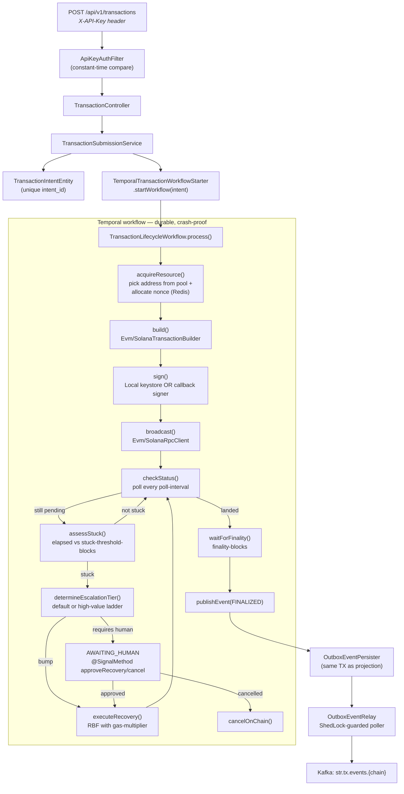
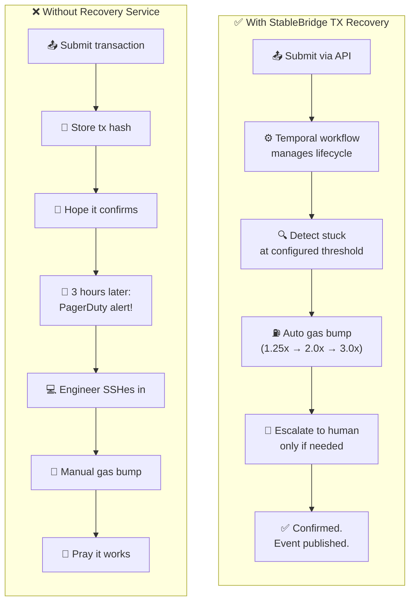
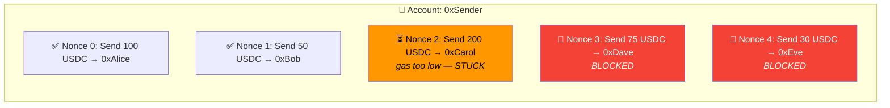
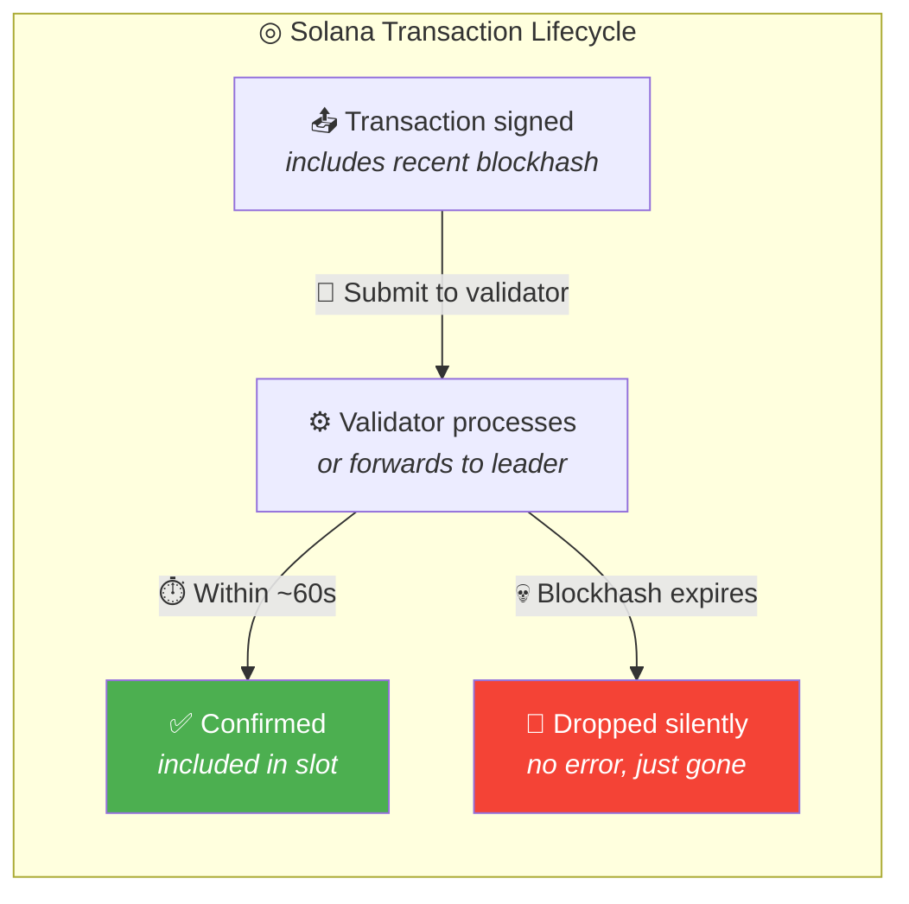
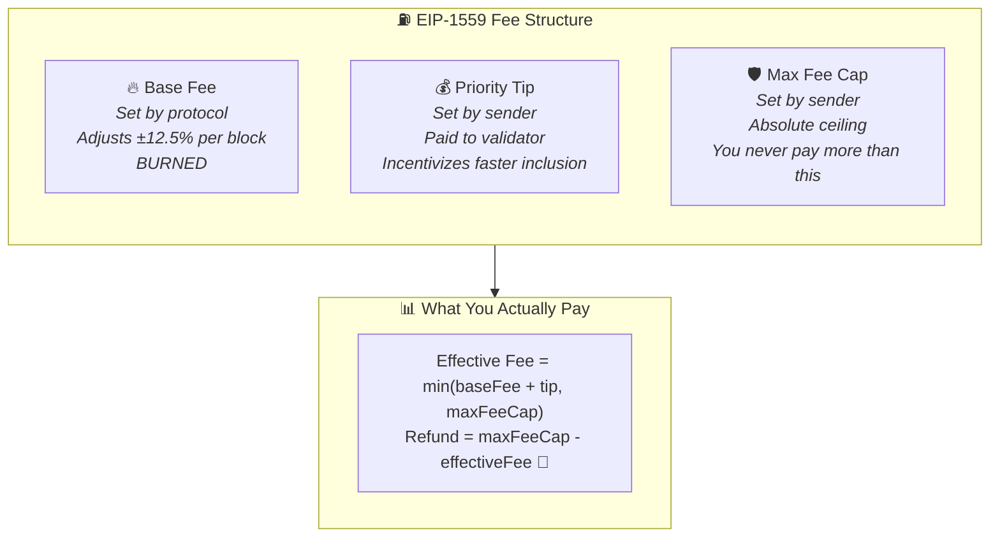
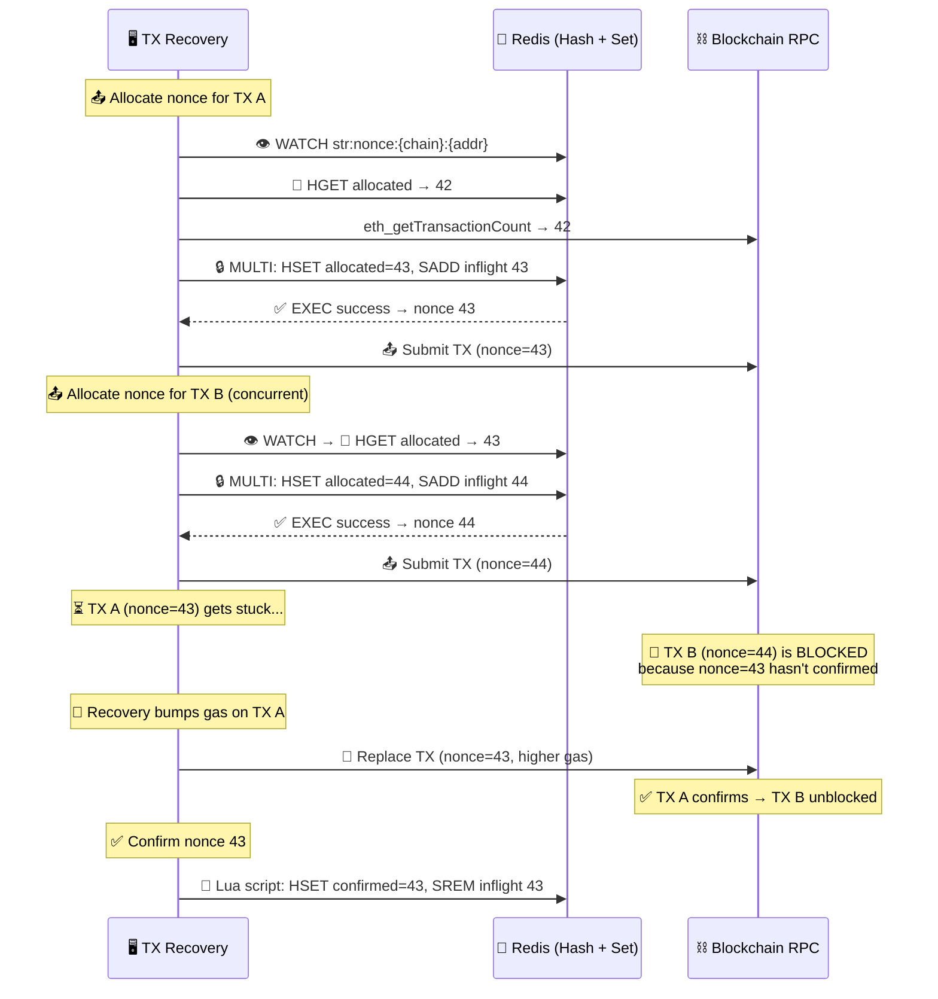
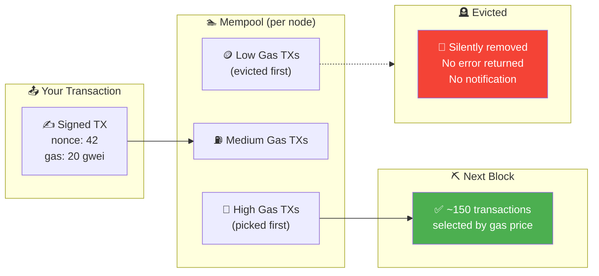
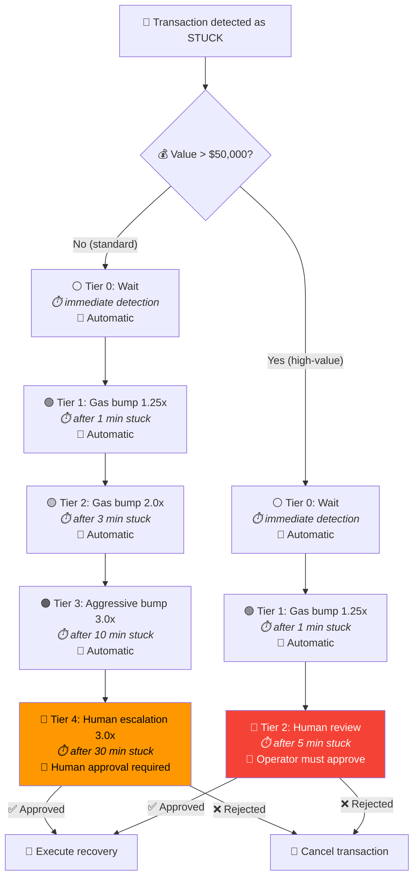
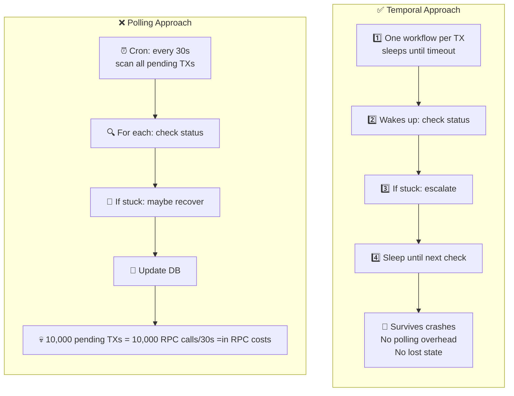
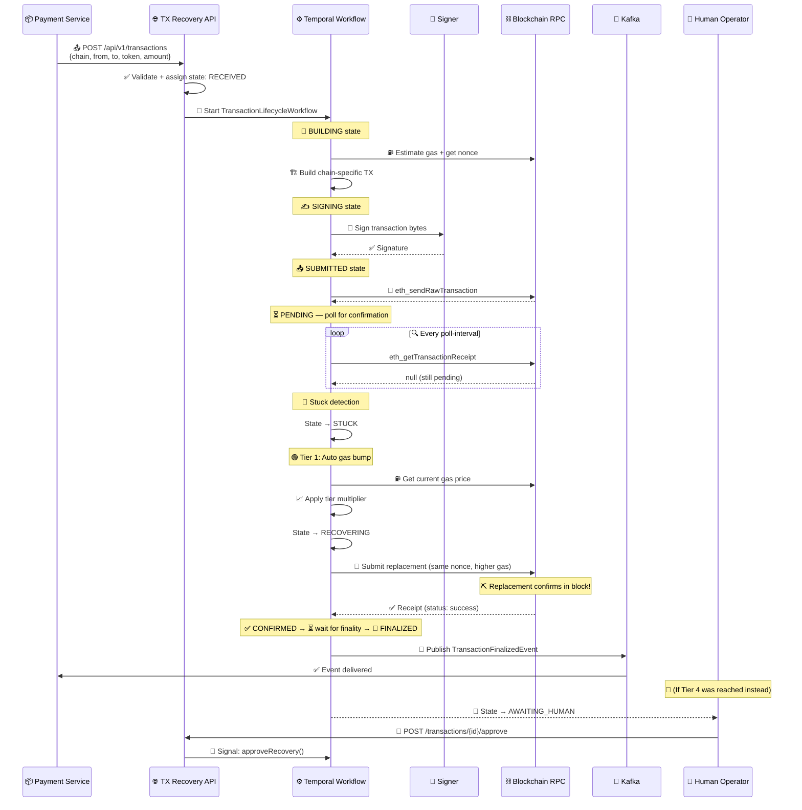

<div align="center">


[](https://deepwiki.com/Puneethkumarck/stablebridge-tx-recovery)

# StableBridge TX Recovery

### Durable transaction lifecycle management for EVM and Solana.

**A Spring Boot 4 microservice that owns a stablecoin transfer from submission to finality — detecting stuck transactions, escalating gas through tiered strategies, routing high-value decisions to humans, and publishing lifecycle events over Kafka. All orchestrated by Temporal workflows that survive crashes.**

[Why this exists?](#-why-this-exists) · [Architecture](#-architecture) · [Transaction Lifecycle](#-the-transaction-lifecycle) · [Escalation Tiers](#-escalation-tiers) · [Quick Start](#-quick-start) · [API](#-api-reference) · [Config](#-configuration-reference)

</div>

---

## The Problem

You submitted a USDC transfer on Ethereum. The RPC node returned a hash. You updated your database. You assumed it confirmed. Three hours later, PagerDuty fires — **47 transactions are stuck behind a nonce gap you didn't know about**, gas has spiked 7×, and someone has to replace all of them by hand.

Blockchains have no built-in notion of "this transfer is your responsibility until it either lands or gives up." Every team that moves stablecoins eventually builds some version of this service. This is ours.

## The Solution

```text
 Client                 str-tx-recovery                   Chain
 ──────                 ───────────────                   ─────

  POST /api/v1/transactions                   ┌─► Ethereum
          │                                   │
          ▼                                   ├─► Base
  TransactionSubmissionService                │
          │                                   ├─► Polygon
          ▼                                   │
  start Temporal workflow ──► build ──► sign ─┴─► broadcast
          │                    │        │              │
          │                    │        │              ▼
          │                    │        │         PENDING
          │                    │        │              │
          │                    │        │       detect STUCK
          │                    │        │              │
          │                    │        │       escalate gas
          │                    │        │         (tiered)
          │                    │        │              │
          │                    │        │       CONFIRMED
          │                    │        │              │
          │                    │        │         FINALIZED
          │                    ▼        ▼              ▼
          └─────────► OutboxEventPersister ──► Kafka (str.tx.events.{chain})
                                          ▲
                                          │
                              OutboxEventRelay (ShedLock-guarded)
```

Every submission becomes a **durable Temporal workflow** that owns the transaction across its entire lifetime — building, signing, broadcasting, polling, assessing stuck conditions, executing recovery, waiting on humans when required, and publishing the terminal outcome to Kafka via a transactional outbox.

## The Result

<div align="center">

| Dimension | What you get |
|---|---|
| **Chains** | Ethereum, Base, Polygon (EVM) + Solana — configured out of the box |
| **Durability** | Temporal workflows survive JVM crashes and restarts (24 h execution, 2 h run, continue-as-new) |
| **Recovery** | 5-level default tier ladder (1.0× → 1.25× → 2.0× → 3.0× → human) and a 3-level high-value ladder |
| **Human escalation** | Signal-driven approval/cancel routed to operators for high-value or aggressive escalations |
| **Delivery** | At-least-once event publish via transactional outbox + ShedLock-coordinated relay |
| **Signing** | Pluggable: `LocalKeystoreSigner` (secp256k1/Ed25519) or `CallbackSignerAdapter` (HMAC-SHA256 remote HSM/KMS) |
| **Nonce safety** | Redis-backed allocator with on-chain sync endpoint |
| **Security** | `X-API-Key` header with constant-time comparison (`MessageDigest.isEqual`) |

</div>

---

## Table of Contents

- [Why This Exists](#-why-this-exists)
- [Architecture](#-architecture)
- [The Transaction Lifecycle](#-the-transaction-lifecycle)
- [The Hot Path: Submission to Finality](#-the-hot-path-submission-to-finality)
- [Temporal Workflow & Activities](#-temporal-workflow--activities)
- [Escalation Tiers](#-escalation-tiers)
- [Supported Chains](#-supported-chains)
- [Signing Strategies](#-signing-strategies)
- [Event-Driven Delivery: Transactional Outbox](#-event-driven-delivery-transactional-outbox)
- [Resilience & Fault Tolerance](#-resilience--fault-tolerance)
- [Tech Stack](#-tech-stack)
- [Module Structure](#-module-structure)
- [Quick Start](#-quick-start)
- [Make Targets](#-make-targets)
- [API Reference](#-api-reference)
- [Configuration Reference](#-configuration-reference)
- [Observability](#-observability)
- [Testing Strategy](#-testing-strategy)
- [Local Infrastructure](#-local-infrastructure)
- [Appendix: Blockchain Recovery Primer](#-appendix-blockchain-recovery-primer)
  - [Why Do Blockchain Transactions Fail?](#why-do-blockchain-transactions-fail)
  - [Understanding Recovery Across Chains](#understanding-recovery-across-chains)
  - [Gas Economics: Why Transactions Get Stuck](#gas-economics-why-transactions-get-stuck)
  - [Nonce Management: The Hidden Complexity](#nonce-management-the-hidden-complexity)
  - [The Mempool: Where Transactions Wait (and Die)](#the-mempool-where-transactions-wait-and-die)
  - [Escalation: From Automatic to Human](#escalation-from-automatic-to-human)
  - [Durable Execution: Why Temporal?](#durable-execution-why-temporal)
  - [The Transaction Recovery Lifecycle](#the-transaction-recovery-lifecycle)
- [License](#-license)

---

## 🤔 Why This Exists

Because every on-chain product eventually has to answer the same questions:

- *"Did my 50 USDC transfer actually land, or is it stuck?"*
- *"How do I bump the gas without double-spending the nonce?"*
- *"When gas spikes 7×, should I bump again or wait?"*
- *"This $200k transfer has been stuck for 10 minutes — who decides what to do?"*
- *"When it finally confirms, how do I tell downstream services without double-publishing?"*

These questions need **durable state, chain-specific expertise, and a decision policy that doesn't require a human for every case**. Fire-and-forget submission code can't answer any of them.

> **🎯 Design principle:** The happy path is just "submit → workflow → confirmed". Everything else — stuck detection, escalation, approval, cancellation, continue-as-new — is the same workflow reacting to signals and activity results. One workflow per transaction. One state machine. No custom schedulers.

---

## 🏛️ Architecture

Strict **hexagonal architecture (ports & adapters)** with DDD tactical patterns. Dependencies always point inward. Verified at build time by ArchUnit.

```text
             ┌─────────────────────────────────────────────────────┐
             │                                                     │
             │              🎯  application/                        │
             │   ┌──────────────────────────────────────────┐      │
             │   │ Controllers (Spring MVC)                 │      │
             │   │   TransactionController /api/v1/tx       │      │
             │   │   ApprovalController                     │      │
             │   │   AddressPoolController /api/v1/addrs    │      │
             │   │   GasOracleController   /api/v1/gas      │      │
             │   │   StatusController      /api/v1/status   │      │
             │   │                                          │      │
             │   │ Temporal wiring                          │      │
             │   │   TransactionLifecycleWorkflow(Impl)     │      │
             │   │   TransactionLifecycleActivities(Impl)   │      │
             │   │   TemporalWorkflowStarter / Signaler     │      │
             │   │                                          │      │
             │   │ Security                                 │      │
             │   │   ApiKeyAuthFilter (X-API-Key)           │      │
             │   └──────────────────────────────────────────┘      │
             │                    │                                │
             │                    ▼ delegates to                   │
             │   ┌──────────────────────────────────────────┐      │
             │   │            🧠 domain/                    │      │
             │   │                                          │      │
             │   │ Services                                 │      │
             │   │   TransactionSubmissionService           │      │
             │   │   TransactionApprovalService             │      │
             │   │   AddressPoolService                     │      │
             │   │   GasOracleQueryService                  │      │
             │   │   StatusService                          │      │
             │   │   EscalationPolicyEngine                 │      │
             │   │                                          │      │
             │   │ Model                                    │      │
             │   │   TransactionIntent   TransactionStatus  │      │
             │   │   PooledAddress       AddressTier        │      │
             │   │   RecoveryPlan        GasBudgetPolicy    │      │
             │   │   SubmissionStrategy  StateMachine       │      │
             │   │                                          │      │
             │   │ Ports (interfaces implemented by infra)  │      │
             │   │   ChainTransactionManager                │      │
             │   │   FeeOracle       TransactionSigner      │      │
             │   │   NonceManager    FeeCache               │      │
             │   │   TransactionEventPublisher              │      │
             │   │   AddressPoolRepository                  │      │
             │   └──────────────────────────────────────────┘      │
             │                    ▲                                │
             │                    │ implements ports               │
             │   ┌──────────────────────────────────────────┐      │
             │   │        🔌 infrastructure/                │      │
             │   │                                          │      │
             │   │  client/evm/      EvmChainTxManager,     │      │
             │   │                   EvmFeeOracle,          │      │
             │   │                   EvmRpcClient, RLP,     │      │
             │   │                   EvmRecoveryStrategy    │      │
             │   │                                          │      │
             │   │  client/solana/   SolanaChainTxManager,  │      │
             │   │                   SolanaFeeOracle,       │      │
             │   │                   SolanaRpcClient,       │      │
             │   │                   SolanaRecoveryStrategy │      │
             │   │                                          │      │
             │   │  signer/          LocalKeystoreSigner,   │      │
             │   │                   CallbackSignerAdapter  │      │
             │   │                                          │      │
             │   │  redis/           RedisNonceManager,     │      │
             │   │                   RedisFeeCache          │      │
             │   │                                          │      │
             │   │  db/              JPA repos + entities   │      │
             │   │  db/outbox/       OutboxEventPersister,  │      │
             │   │                   OutboxEventReader      │      │
             │   │  stream/          OutboxEventRelay,      │      │
             │   │                   Kafka publisher        │      │
             │   │                                          │      │
             │   │  health/          Rpc/Redis/Kafka        │      │
             │   │  metrics/         Micrometer recorders   │      │
             │   └──────────────────────────────────────────┘      │
             │                                                     │
             └─────────────────────────────────────────────────────┘

                  🛡️ ArchUnit enforces layer rules at build time
```

**Layer rules (enforced by `ArchitectureTest`):**

| Rule | What it stops |
|---|---|
| `domain` ⊥ `application` | Domain cannot reach up into controllers or Temporal wiring |
| `domain` ⊥ `infrastructure` | Domain cannot import JDBC, Redis, Kafka, web3 types |
| `infrastructure` ⊥ `application` | Outbound adapters cannot call controllers |
| No `@Autowired` field injection | Constructor injection only (`@RequiredArgsConstructor`) |
| No `System.out` / `System.err` | Structured logs via `@Slf4j` only |

Break any rule → the build fails.

---

## 🔁 The Transaction Lifecycle

The `TransactionStatus` enum defines **14 states, 3 of them terminal**. This is the exact set declared in [`domain/transaction/model/TransactionStatus.java`](stablebridge-tx-recovery/src/main/java/com/stablebridge/txrecovery/domain/transaction/model/TransactionStatus.java).

```text
                              ┌───── terminal ─────┐
                              ▼                    ▼
  RECEIVED                FINALIZED             FAILED
     │                        ▲                    ▲
     ▼                        │                    │
  BUILDING                    │                    │
     │                        │                    │
     ▼                        │                    │
  SIGNING                     │                    │
     │                        │                    │
     ▼                        │                    │
  SUBMITTED ─────► PENDING ───┤
     │                │       │
     │                ▼       │
     │              STUCK ────┤
     │                │       │
     │                ▼       │
     │          RECOVERING ───┤
     │                │       │
     │                ▼       │
     │         AWAITING_HUMAN │
     │                │       │
     │                ▼       │
     │           CANCELLING ──┘
     │                │
     │                ▼
     └──────►   CANCELLED   (terminal)

          CONFIRMED ──► FINALIZED  (once finality-blocks reached)
          DROPPED (terminal — never landed)
```

**Terminal states:** `FINALIZED`, `FAILED`, `CANCELLED` — checked by `TransactionStatus.isTerminal()`.

---

## ⚡ The Hot Path: Submission to Finality

The flow below describes what actually happens when a client POSTs to `/api/v1/transactions` — every class name and decision point is taken from the source.



**Two concurrency boundaries worth noting:**

| Boundary | How it's protected |
|---|---|
| **Nonce allocation** | Redis-backed `RedisNonceManager` allocates via Lua scripts; on-chain truth is re-hydrated through `POST /addresses/{address}/nonces/sync` |
| **Event publish** | Domain events land in the `outbox_event` table in the *same* JDBC transaction as the state change — the `OutboxEventRelay` publishes them afterwards, and `ShedLock` (table `V14__STR_102_create_shedlock.sql`) prevents duplicate relays across instances |

---

## 🧵 Temporal Workflow & Activities

The workflow interface lives at [`application/workflow/TransactionLifecycleWorkflow.java`](stablebridge-tx-recovery/src/main/java/com/stablebridge/txrecovery/application/workflow/TransactionLifecycleWorkflow.java). The implementation in `TransactionLifecycleWorkflowImpl` drives the state machine and delegates every side-effect to activities.

| Type | Name | Purpose |
|---|---|---|
| `@WorkflowMethod` | `process(intent, continueState)` | The main driver — loops through the state machine until terminal |
| `@SignalMethod` | `approveRecovery(approval)` | Operator unblocks an `AWAITING_HUMAN` state |
| `@SignalMethod` | `cancelTransaction(cancelRequest)` | Operator requests on-chain cancel |
| `@QueryMethod` | `getStatus()` | Returns a `TransactionSnapshot` without side effects |

**Activity interface** ([`TransactionLifecycleActivities.java`](stablebridge-tx-recovery/src/main/java/com/stablebridge/txrecovery/application/workflow/TransactionLifecycleActivities.java)) — every boundary-crossing operation is an activity so Temporal can retry, log and checkpoint it:

```
acquireResource   releaseResource    consumeResource
build             sign               broadcast
checkStatus       waitForFinality    getPollInterval
calculateGasBudget assessStuck       determineEscalationTier
executeRecovery   cancelOnChain
publishEvent      recordApproval
```

**Activity timeouts** are per-profile, taken directly from `application.yml`:

| Profile | `start-to-close-timeout` | `max-attempts` | Initial interval | Backoff |
|---|---|---|---|---|
| `default-options` | `PT30S` | 3 | `PT1S` | `2.0` |
| `signing` | `PT10S` | 2 | `PT1S` | `2.0` |
| `confirmation` | `PT300S` | 1 | `PT1S` | `2.0` |
| `recovery-execution` | `PT60S` | 3 | `PT1S` | `2.0` |

**Non-retryable exceptions** (configured in `application.yml` → `str.temporal.non-retryable-exceptions`): `NonRetryableException`, `NonceTooLowException`. Everything else follows the profile's retry policy.

**Continue-as-new:** The workflow carries a `ContinueAsNewState` parameter so it can continue itself when a long-running recovery approaches the 2-hour run timeout without losing event history.

---

## 📐 Escalation Tiers

Escalation is **not** hard-coded — it is loaded from `str.escalation.*` at startup and drives the `determineEscalationTier` activity. Two ladders are configured in [`application.yml`](stablebridge-tx-recovery/src/main/resources/application.yml).

**Default ladder** (transaction value ≤ `high-value-threshold-usd`, default `$50,000`):

| Level | `stuck-threshold` | `gas-multiplier` | Requires human? | Description |
|---|---|---|---|---|
| 0 | `PT0S` | `1.0` | No | Initial detection — wait |
| 1 | `PT1M` | `1.25` | No | First speed-up |
| 2 | `PT3M` | `2.0` | No | Second speed-up |
| 3 | `PT10M` | `3.0` | No | Aggressive speed-up |
| 4 | `PT30M` | `3.0` | **Yes** | Human escalation |

**High-value ladder** (transaction value > `$50,000`) — fewer, more conservative bumps before escalating:

| Level | `stuck-threshold` | `gas-multiplier` | Requires human? | Description |
|---|---|---|---|---|
| 0 | `PT0S` | `1.0` | No | Initial detection — wait |
| 1 | `PT1M` | `1.25` | No | First speed-up |
| 2 | `PT5M` | `1.25` | **Yes** | Human escalation for high-value |

**Gas budget guardrails** (`str.escalation.gas-budget.*`): spend at most `1%` of transaction value on gas, clamped to `$5 min` / `$500 max`. The `EscalationPolicyEngine` refuses to RBF if the next bump would exceed the budget — at which point the workflow transitions to `AWAITING_HUMAN`.

**Submission strategy** (`str.submission.*`): transactions ≥ `sequential-threshold-usd` ($100,000) use `SubmissionStrategy.SEQUENTIAL`; below that, the service uses `PIPELINED` submission with `max-pipeline-depth: 20`.

---

## ⛓️ Supported Chains

Four chains are preconfigured under `str.chains.*` in `application.yml`. Toggle each with `enabled: true|false`.

| Chain | Family | Chain ID | Finality | Stuck threshold | Poll interval | Max fee cap | Preloaded tokens |
|---|---|---|---|---|---|---|---|
| `ethereum_mainnet` | `EVM` | `1` | 12 blocks | 250 blocks | `PT12S` | 200 gwei | USDC, USDT |
| `base_mainnet` | `EVM` | `8453` | 1 block | 100 blocks | `PT2S` | 5 gwei | USDC |
| `polygon_mainnet` | `EVM` | `137` | 256 blocks | 500 blocks | `PT2S` | 500 gwei | USDC.e, USDT |
| `solana_mainnet` | `SOLANA` | — | 31 slots | 150 slots | `400ms` | — | USDC |

Each chain has its own Resilience4j circuit breaker and rate limiter:

```yaml
rpc:
  urls: [ ... ]
  timeout: PT5S
  max-retries: 3
  rate-limit-rps: 25
  rate-limit-burst: 50
  circuit-breaker:
    failure-rate-threshold: 50    # percent
    wait-duration-in-open-state: PT30S
    sliding-window-size: 10
```

**EVM adapter** ([`infrastructure/client/evm/`](stablebridge-tx-recovery/src/main/java/com/stablebridge/txrecovery/infrastructure/client/evm/)): `EvmChainTransactionManager`, `EvmRpcClient`, `EvmFeeOracle` (EIP-1559), `EvmTransactionBuilder` (RLP-encoded), `EvmRecoveryStrategy` (gas bump RBF), `EvmOnChainNonceProvider`.

**Solana adapter** ([`infrastructure/client/solana/`](stablebridge-tx-recovery/src/main/java/com/stablebridge/txrecovery/infrastructure/client/solana/)): `SolanaChainTransactionManager`, `SolanaRpcClient`, `SolanaFeeOracle` (prioritization fees), `SolanaTransactionBuilder` (blockhash + compute budget), `SolanaRecoveryStrategy`.

---

## 🔐 Signing Strategies

Two pluggable signer implementations live under [`infrastructure/signer/`](stablebridge-tx-recovery/src/main/java/com/stablebridge/txrecovery/infrastructure/signer/). The `SignerAutoConfiguration` picks one based on `str.signer.backend`.

```text
 ┌──────────────────────────┐       ┌──────────────────────────┐
 │ 🗝️  LocalKeystoreSigner  │       │ 📞 CallbackSignerAdapter │
 ├──────────────────────────┤       ├──────────────────────────┤
 │ backend: local           │       │ backend: callback        │
 │ keystore-path: /etc/...  │       │ POST unsigned tx →       │
 │ password: ${...}         │       │    remote endpoint       │
 │                          │       │ HMAC-SHA256 verify       │
 │ secp256k1 (EVM)          │       │ TLS verify configurable  │
 │ Ed25519    (Solana)      │       │ Timeout: PT5S default    │
 │ Bouncy Castle + JCE      │       │ Chain-agnostic           │
 └──────────────────────────┘       └──────────────────────────┘
```

| Config property | Local | Callback |
|---|---|---|
| `str.signer.backend` | `local` | `callback` |
| `str.signer.keystore-path` | ✅ | — |
| `str.signer.password` | ✅ | — |
| `str.signer.callback.hmac-secret` | — | ✅ |
| `str.signer.callback.timeout` | — | `PT5S` |
| `str.signer.callback.tls.verify` | — | `true` |

A helper Gradle task generates signing keypairs for local dev: `make generate-key CHAIN_TYPE=solana` → emits `keys.json`.

---

## 📮 Event-Driven Delivery: Transactional Outbox

The service guarantees **at-least-once delivery** of lifecycle events to Kafka using a classic transactional outbox. No "dual-write" — the outbox row and the domain change land in the same Postgres transaction.

```text
 ┌──────────────────────────────┐    ┌──────────────────────────────┐
 │ Workflow activity            │    │ OutboxEventRelay             │
 │                              │    │                              │
 │ BEGIN TX                     │    │ ShedLock: at most 1 relay at │
 │   write transaction_intent   │    │   a time across the cluster  │
 │   OutboxEventPersister.save()│    │                              │
 │     → outbox_event (PENDING) │    │ loop:                        │
 │ COMMIT                       │    │   readBatch(PENDING)         │
 └──────────────────────────────┘    │   foreach event:             │
                                     │     KafkaTemplate.send(      │
                                     │       str.tx.events.{chain}) │
                                     │     mark PUBLISHED           │
                                     │   sleep poll-interval        │
                                     └──────────────────────────────┘
```

| Concern | Implementation |
|---|---|
| Outbox table | `V13__STR_102_create_outbox_event.sql` — status (PENDING/PUBLISHED/FAILED), retry count, topic, partition key, JSON payload |
| Distributed lock | `V14__STR_102_create_shedlock.sql` — ShedLock table guards the relay so only one instance polls at a time |
| Enabled chains | `str.kafka.enabled-chains` (default `ethereum_mainnet,solana_mainnet`) |
| Topic replicas | `str.kafka.topic-replicas` (default `1`) |
| Topic naming | `str.tx.events.{chain}` |

The in-process publisher (`OutboxTransactionEventPublisher`) implements the domain port `TransactionEventPublisher` — the workflow doesn't know Kafka exists.

---

## 🛡️ Resilience & Fault Tolerance

```text
┌──────────────────────────────────────────────────────────────┐
│ Layer             Technology         What it protects        │
├──────────────────────────────────────────────────────────────┤
│ Circuit breaker   Resilience4j       Failing RPC endpoints   │
│                   (per chain)        50% threshold / 30 s    │
│                                      open / 10-call window   │
│                                                              │
│ Rate limiter      Resilience4j       RPC provider throttling │
│                   (per chain)        25 rps sustained,       │
│                                      50 rps burst            │
│                                                              │
│ Retry + backoff   Temporal activity  Transient activity      │
│                   retry options      failures (2.0× backoff) │
│                                                              │
│ Non-retryable     str.temporal.*     Logic errors & nonce    │
│                   exception list     mismatches fail fast    │
│                                                              │
│ At-least-once     Outbox + ShedLock  Kafka delivery through  │
│ delivery                             crashes / restarts      │
│                                                              │
│ Durable exec      Temporal workflow  JVM restarts, process   │
│                   (24 h exec, 2 h    crashes, continue-as-   │
│                   run, cont-as-new)  new on long recoveries  │
│                                                              │
│ Nonce consistency RedisNonceManager  Concurrent submissions  │
│                   + Lua scripts      against the same addr   │
└──────────────────────────────────────────────────────────────┘
```

---

## 🛠️ Tech Stack

| Component | Choice | Version |
|---|---|---|
| **Language** | Java | 25 LTS |
| **Framework** | Spring Boot | 4.0.3 |
| **Build** | Gradle + Kotlin DSL + `buildSrc/` convention plugins | — |
| **Database** | PostgreSQL (Testcontainers in tests) | 16 |
| **Migrations** | Flyway | V1 → V14 |
| **Object mapping** | MapStruct | 1.6.3 |
| **Workflow engine** | Temporal Java SDK | — |
| **Messaging** | Kafka wire protocol via Redpanda (dev) | 24.3.x |
| **Cache / nonce state** | Redis Stack | 7.4.0-v8 |
| **Distributed lock** | ShedLock (outbox relay) | — |
| **Resilience** | Resilience4j (circuit breaker, rate limiter) | — |
| **Crypto** | Bouncy Castle (secp256k1, Ed25519) | — |
| **Metrics** | Micrometer → Prometheus | — |
| **Container image** | Jib (no Dockerfile) | — |
| **Architecture tests** | ArchUnit | — |
| **Logging** | SLF4J + Logback | — |
| **Testing** | JUnit 5 + Mockito (BDD) + AssertJ + Testcontainers + Awaitility | — |

### Explicitly Not Used

| Avoided | Replacement | Why |
|---|---|---|
| `@Autowired` field injection | `@RequiredArgsConstructor` + `private final` | Testable, immutable, no reflection surprises |
| `System.out` / `println` | `@Slf4j` | Structured logs only |
| Mockito `when()` / `verify()` | BDD `given()` / `then().should()` | Consistent given/when/then narrative |
| Generic matchers (`any()`) | Actual values | Tests assert on real data, not "anything" |
| Comments & Javadoc | Self-documenting code | Enforced by project standards |

---

## 🧱 Module Structure

```text
stablebridge-tx-recovery/                       ← root (convention plugins only)
│
├── buildSrc/                                   ← Gradle convention plugins
│   └── src/main/kotlin/
│       ├── stablebridge-tx-recovery.service.gradle.kts   ← applied to main service
│       └── stablebridge-tx-recovery.library.gradle.kts   ← applied to shared lib
│
├── stablebridge-tx-recovery/                   ← main Spring Boot service
│   └── src/
│       ├── main/java/com/stablebridge/txrecovery/
│       │   ├── Application.java                ← @SpringBootApplication
│       │   ├── application/
│       │   │   ├── controller/                 ← REST controllers (5)
│       │   │   ├── workflow/                   ← Temporal workflow + activities
│       │   │   ├── config/                     ← StrProperties, Temporal/Redis/Kafka config
│       │   │   └── security/                   ← ApiKeyAuthFilter
│       │   │
│       │   ├── domain/                         ← pure — no framework imports
│       │   │   ├── transaction/                ← TransactionSubmissionService, state machine
│       │   │   ├── address/                    ← AddressPoolService, AddressTier
│       │   │   ├── recovery/                   ← EscalationPolicyEngine, GasBudgetPolicy
│       │   │   ├── status/                     ← StatusService
│       │   │   └── common/model/               ← StateMachine, StateChangedEvent
│       │   │
│       │   └── infrastructure/                 ← outbound adapters
│       │       ├── client/evm/                 ← EVM JSON-RPC + RLP
│       │       ├── client/solana/              ← Solana JSON-RPC
│       │       ├── signer/                     ← local + callback signers
│       │       ├── redis/                      ← nonce mgr + fee cache
│       │       ├── db/                         ← JPA repos + outbox
│       │       ├── stream/                     ← Kafka publisher + outbox relay
│       │       ├── health/                     ← Rpc / Redis / Kafka health
│       │       └── metrics/                    ← Micrometer recorders
│       │
│       └── main/resources/
│           ├── application.yml                 ← all str.* properties
│           ├── application-testnet.yml         ← Sepolia + Solana devnet overrides
│           ├── db/migration/                   ← Flyway V1 → V14
│           └── logback-spring.xml
│
├── stablebridge-tx-recovery-api/               ← shared DTOs (java-library)
│   └── src/main/java/com/stablebridge/txrecovery/api/model/
│       ├── SubmitTransactionRequest / ...Response
│       ├── SubmitBatchRequest / BatchTransactionResponse
│       ├── ApproveTransactionRequest / ...Response
│       ├── CancelTransactionRequest / ...Response
│       ├── RegisterAddressRequest / AddressResponse
│       ├── DrainResponse / NonceSyncResponse
│       ├── GasEstimateResponse / GasHistoryResponse / GasHistoryEntry / GasTierEstimate
│       ├── ChainStatusSummaryResponse / ChainStatusDetailResponse
│       ├── TransactionResponse / PagedResponse
│       ├── ApprovalActionDto / ErrorResponse
│       └── package-info.java
│
├── docs/                                       ← ADR, coding / testing standards,
│                                                 temporal patterns, live-test results
├── infra/                                      ← Prometheus + Grafana provisioning,
│                                                 Terraform (local Docker provider)
├── postman/str-collection.json                 ← importable API collection
├── docker-compose.yml                          ← full local stack
├── Makefile                                    ← developer workflow
└── CLAUDE.md                                   ← agent instructions
```

---

## 🚀 Quick Start

### Prerequisites

- **Docker** & **Docker Compose** (PostgreSQL, Redis, Redpanda, Temporal, Prometheus, Grafana)
- **Java 25** (for local Gradle builds)
- **Make** (optional — thin wrappers around `./gradlew` and `docker compose`)

### 60-Second Onboarding

```bash
# 1. Clone
git clone https://github.com/Puneethkumarck/stablebridge-tx-recovery.git
cd stablebridge-tx-recovery

# 2. Start the whole stack (infrastructure only)
make infra-up

# 3. Build and run the service locally
make run

# 4. Register a signing address and sync its nonce from chain
make register-address ADDR=0xYourAddress CHAIN=ethereum_mainnet TIER=HOT
make sync-nonce       ADDR=0xYourAddress CHAIN=ethereum_mainnet

# 5. Submit a transaction
make submit-tx INTENT=11111111-1111-1111-1111-111111111111 \
               CHAIN=ethereum_mainnet \
               TO=0xRecipient \
               AMOUNT=20 \
               TOKEN=USDC \
               DECIMALS=6 \
               CONTRACT=0xA0b86991c6218b36c1d19D4a2e9Eb0cE3606eB48
```

Once running, `make` will print the URLs:

```
App API:           http://localhost:8080/api/v1/status
Actuator Health:   http://localhost:8081/actuator/health
Prometheus scrape: http://localhost:8081/actuator/prometheus

Temporal UI:       http://localhost:8088
Redis Insight:     http://localhost:8001
Prometheus:        http://localhost:9091
Grafana:           http://localhost:3000  (admin/admin)
```

### Run Everything in Docker

```bash
make up          # builds image via Jib + starts infra + app
make up-testnet  # same, but with --spring.profiles.active=testnet
make down        # stops everything
```

---

## 🎛️ Make Targets

| Target | Description |
|---|---|
| `make build` | Compile + Spotless + unit + integration tests |
| `make test` | Unit tests only |
| `make integration-test` | Integration tests (requires Docker) |
| `make format` | Auto-format with Spotless |
| `make check` | Spotless check + full build |
| `make run` | Run service with default (mainnet) profile |
| `make run-testnet` | Run with `application-testnet.yml` |
| `make infra-up` / `infra-down` / `infra-clean` / `infra-status` / `infra-logs` | Local stack control |
| `make up` / `up-testnet` / `down` | App + infra in Docker |
| `make docker-build` | Build image via Jib |
| `make check-health` / `check-status` / `check-redis` / `check-kafka` / `check-temporal` | Quick operational probes |
| `make register-address` / `sync-nonce` / `submit-tx` / `generate-key` | Test operations |
| `make terraform-init` / `terraform-up` / `terraform-down` | Local Terraform provisioning |
| `make help` | List every target |

---

## 🌐 API Reference

Base URL: `http://localhost:8080`. **Every endpoint requires `X-API-Key` — `ApiKeyAuthFilter` rejects unauthenticated requests with `STR-4010`.**

### Transactions — [`TransactionController.java`](stablebridge-tx-recovery/src/main/java/com/stablebridge/txrecovery/application/controller/transaction/TransactionController.java)

| Method | Path | Description |
|---|---|---|
| `POST` | `/api/v1/transactions` | Submit one `SubmitTransactionRequest` |
| `POST` | `/api/v1/transactions/batch` | Submit a `SubmitBatchRequest` atomically |
| `GET`  | `/api/v1/transactions/{transactionId}` | Fetch one by ID |
| `GET`  | `/api/v1/transactions` | List — query params: `chain`, `status`, `fromAddress`, `toAddress`, `token`, `fromDate`, `toDate`, `page`, `size` |

### Approvals & Cancellations — [`ApprovalController.java`](stablebridge-tx-recovery/src/main/java/com/stablebridge/txrecovery/application/controller/approval/ApprovalController.java)

| Method | Path | Description |
|---|---|---|
| `POST` | `/api/v1/transactions/{transactionId}/approve` | Unblocks `AWAITING_HUMAN` — sends `approveRecovery` signal |
| `POST` | `/api/v1/transactions/{transactionId}/cancel` | Sends `cancelTransaction` signal |

### Address Pool — [`AddressPoolController.java`](stablebridge-tx-recovery/src/main/java/com/stablebridge/txrecovery/application/controller/address/AddressPoolController.java)

| Method | Path | Description |
|---|---|---|
| `POST`   | `/api/v1/addresses` | Register address — body: `RegisterAddressRequest` (`HOT` / `PRIORITY` / `COLD` tier) |
| `GET`    | `/api/v1/addresses?chain=&tier=&status=` | List with filters |
| `DELETE` | `/api/v1/addresses/{address}?chain=` | Drain (status → `DRAINING`) |
| `POST`   | `/api/v1/addresses/{address}/nonces/sync?chain=` | Refetch on-chain nonce into Redis |

### Gas Oracle — [`GasOracleController.java`](stablebridge-tx-recovery/src/main/java/com/stablebridge/txrecovery/application/controller/gas/GasOracleController.java)

| Method | Path | Description |
|---|---|---|
| `GET` | `/api/v1/gas/{chain}` | Current gas estimates (by urgency: FAST / STANDARD / SLOW) |
| `GET` | `/api/v1/gas/{chain}/history?hours=24` | Historical gas (1 ≤ hours ≤ 168) |

### Chain Status — [`StatusController.java`](stablebridge-tx-recovery/src/main/java/com/stablebridge/txrecovery/application/controller/status/StatusController.java)

| Method | Path | Description |
|---|---|---|
| `GET` | `/api/v1/status` | Summary list for all configured chains |
| `GET` | `/api/v1/status/{chain}` | Detail for a specific chain |

### Management (port **8081**)

| Path | Description |
|---|---|
| `/actuator/health` | Composite health — includes `RpcHealthIndicator`, `RedisHealthIndicator`, `KafkaHealthIndicator`, `TemporalHealthIndicator`, JDBC |
| `/actuator/prometheus` | Prometheus scrape endpoint |
| `/actuator/info` | Build info |

### Error Response

```json
{
  "error": "STR-4010",
  "message": "Unauthorized"
}
```

| Prefix | Category |
|---|---|
| `STR-400x` | Bad request / validation |
| `STR-401x` | Authentication |
| `STR-404x` | Not found |
| `STR-409x` | Conflict / state violation |
| `STR-500x` | Internal server error |

---

## ⚙️ Configuration Reference

All custom properties use the `str.*` prefix and are bound via `StrProperties`. Every entry below comes from [`application.yml`](stablebridge-tx-recovery/src/main/resources/application.yml).

<details>
<summary><b>Signer</b> (<code>str.signer.*</code>)</summary>

| Property | Default | Description |
|---|---|---|
| `str.signer.backend` | — | `local` or `callback` |
| `str.signer.keystore-path` | — | PKCS12/JKS keystore path (local backend) |
| `str.signer.password` | — | Keystore password |
| `str.signer.callback.hmac-secret` | — | HMAC-SHA256 verification secret |
| `str.signer.callback.timeout` | `PT5S` | HTTP callback timeout |
| `str.signer.callback.tls.verify` | `true` | Verify remote signer TLS certificate |

</details>

<details>
<summary><b>Kafka</b> (<code>str.kafka.*</code>)</summary>

| Property | Default | Description |
|---|---|---|
| `str.kafka.enabled-chains` | `ethereum_mainnet,solana_mainnet` | Comma-separated chain IDs producing events |
| `str.kafka.topic-replicas` | `1` | Topic replication factor |

Topic naming: `str.tx.events.{chain}`.
</details>

<details>
<summary><b>Temporal</b> (<code>str.temporal.*</code>)</summary>

| Property | Default | Description |
|---|---|---|
| `str.temporal.target` | `127.0.0.1:7233` | Frontend address |
| `str.temporal.namespace` | `stablebridge-tx-recovery` | Namespace |
| `str.temporal.task-queue` | `str-transaction-lifecycle` | Worker task queue |
| `str.temporal.workflow-execution-timeout` | `PT24H` | Max total execution time |
| `str.temporal.workflow-run-timeout` | `PT2H` | Max per-run time (before continue-as-new) |
| `str.temporal.non-retryable-exceptions` | `NonRetryableException`, `NonceTooLowException` | Fail-fast classes |
| `str.temporal.activity-options.*` | see [workflow section](#-temporal-workflow--activities) | Per-profile activity retry policy |

</details>

<details>
<summary><b>Escalation</b> (<code>str.escalation.*</code>)</summary>

| Property | Default | Description |
|---|---|---|
| `str.escalation.high-value-threshold-usd` | `50000` | Switches to high-value ladder |
| `str.escalation.gas-budget.percentage` | `0.01` | Gas budget as fraction of tx value |
| `str.escalation.gas-budget.absolute-min-usd` | `5` | Minimum gas budget |
| `str.escalation.gas-budget.absolute-max-usd` | `500` | Maximum gas budget |
| `str.escalation.default-tiers[]` | see table | Default ladder |
| `str.escalation.high-value-tiers[]` | see table | High-value ladder |

</details>

<details>
<summary><b>Submission</b> (<code>str.submission.*</code>)</summary>

| Property | Default | Description |
|---|---|---|
| `str.submission.sequential-threshold-usd` | `100000` | Above this, use `SEQUENTIAL` strategy |
| `str.submission.max-pipeline-depth` | `20` | Max in-flight transactions per address in `PIPELINED` mode |

</details>

<details>
<summary><b>Redis</b> (<code>str.redis.*</code>)</summary>

| Property | Default | Description |
|---|---|---|
| `str.redis.host` | `${STR_REDIS_HOST:localhost}` | Redis host |
| `str.redis.port` | `${STR_REDIS_PORT:6379}` | Redis port |

Used by `RedisNonceManager` (atomic allocation via Lua) and `RedisFeeCache` (per-chain `FeeEstimate` by urgency).

</details>

<details>
<summary><b>Chains</b> (<code>str.chains.{id}.*</code>)</summary>

| Property | Type | Description |
|---|---|---|
| `.enabled` | boolean | Enable/disable chain |
| `.chain-family` | String | `EVM` or `SOLANA` |
| `.chain-id` | int | Numeric chain ID (EVM) |
| `.finality-blocks` | int | Blocks (or slots for Solana) until finalized |
| `.stuck-threshold-blocks` | int | Blocks elapsed before marking stuck |
| `.poll-interval` | Duration | Status polling cadence |
| `.max-fee-cap-gwei` | int | Hard upper bound on gas price (EVM) |
| `.token-contracts` | List<String> | ERC-20 contract addresses (EVM) |
| `.token-mints` | List<String> | SPL mint addresses (Solana) |
| `.rpc.urls` / `.rpc.timeout` / `.rpc.max-retries` | — | RPC endpoints + retries |
| `.rpc.rate-limit-rps` / `.rpc.rate-limit-burst` | — | Resilience4j rate limiter |
| `.rpc.circuit-breaker.*` | — | Resilience4j circuit breaker |

</details>

### Environment Variables

| Variable | Description |
|---|---|
| `DB_HOST` / `DB_PORT` / `DB_NAME` / `DB_USERNAME` / `DB_PASSWORD` | PostgreSQL connection |
| `STR_REDIS_HOST` / `STR_REDIS_PORT` | Redis connection |
| `TEMPORAL_FRONTEND_URL` | Temporal frontend address |
| `STR_SIGNER_BACKEND` / `STR_SIGNER_KEYSTORE_PATH` / `STR_SIGNER_PASSWORD` | Local signer |
| `STR_SIGNER_CALLBACK_HMAC_SECRET` | Callback signer |
| `EVM_ETHEREUM_RPC_URL` / `EVM_BASE_RPC_URL` / `EVM_POLYGON_RPC_URL` | EVM RPC endpoints |
| `SOLANA_RPC_URL` | Solana RPC endpoint |
| `STR_API_KEY` | Primary API key accepted by `ApiKeyAuthFilter` |

---

## 📊 Observability

### Metrics (Micrometer → Prometheus)

Every metric name below is registered verbatim by the classes in [`infrastructure/metrics/`](stablebridge-tx-recovery/src/main/java/com/stablebridge/txrecovery/infrastructure/metrics/).

**Transactions** — `TransactionMetrics`:

- `str.transactions.submitted.total` (counter)
- `str.transactions.confirmed.total` (counter)
- `str.transactions.stuck.total` (counter)
- `str.transactions.recovered.total` (counter)
- `str.transactions.failed.total` (counter)
- `str.transactions.cancelled.total` (counter)
- `str.transaction.confirmation.duration.seconds` (timer)
- `str.transaction.stuck.duration.seconds` (timer)

**Human approvals** — `EscalationMetrics`:

- `str.human.escalation.total` (counter)
- `str.human.escalation.pending` (gauge)
- `str.human.response.duration.seconds` (timer)

**Address pool** — `AddressPoolMetrics`:

- `str.address.pool.size` (gauge)
- `str.address.pool.in.flight` (gauge)

**Nonces** — `NonceMetrics`:

- `str.nonce.allocated.total` (counter)
- `str.nonce.gaps.detected.total` (counter)
- `str.nonce.in.flight` (gauge)

**Recovery** — `RecoveryMetrics`:

- `str.recovery.attempts.total` (counter)
- `str.recovery.gas.spent.total` (counter)

**Gas oracle** — `GasOracleMetrics`:

- `str.gas.base.fee.gwei` (gauge)
- `str.gas.estimate.gwei` (gauge)

Scrape URL: `http://localhost:8081/actuator/prometheus`. Grafana dashboards provisioned from `infra/grafana/`.

### Health Indicators

| Indicator | Verifies |
|---|---|
| `RpcHealthIndicator` | All configured chains reachable |
| `RedisHealthIndicator` | Redis `PING` succeeds |
| `KafkaHealthIndicator` | Kafka broker reachable |
| `TemporalHealthIndicator` | Temporal frontend reachable |
| (Spring Boot built-ins) | PostgreSQL / disk / liveness / readiness |

Endpoint: `http://localhost:8081/actuator/health` with `show-details: always`.

### Logging

Structured logs via `@Slf4j` + Logback, configured in [`logback-spring.xml`](stablebridge-tx-recovery/src/main/resources/logback-spring.xml). MDC context propagates `transactionId` / `chain` / `intentId` through workflow activities (`MdcContextTest` covers it).

---

## 🧪 Testing Strategy

Three-tier pyramid with strict conventions documented in [`docs/TESTING_STANDARDS.md`](docs/TESTING_STANDARDS.md).

```text
              ┌────────────────────┐
              │  Integration Tests │  Spring Boot Test + Testcontainers
              │  (src/integration- │  @PgTest, @KafkaTest, @RedisTest
              │   test/)           │  real chains via stub RPC
              ├────────────────────┤
              │  Architecture Test │  ArchUnit: hexagonal rules,
              │  (ArchitectureTest)│  no @Autowired, no System.out
          ┌───┴────────────────────┴───┐
          │        Unit Tests          │  JUnit 5 + Mockito BDD + AssertJ
          │  (src/test/, testFixtures) │  no Spring context
          └────────────────────────────┘
```

| Tier | Source set | Framework | Docker? |
|---|---|---|---|
| Unit | `src/test/` | JUnit 5, Mockito BDD, AssertJ, Awaitility | No |
| Architecture | `src/test/` | ArchUnit | No |
| Integration | `src/integration-test/` | Spring Boot Test + Testcontainers (PostgreSQL, Kafka, Redis) | **Yes** |

**Non-negotiable testing rules:**

- Single-assert: `assertThat(actual).usingRecursiveComparison().isEqualTo(expected)`
- BDD Mockito only — `given()` / `then().should()`, never `when()` / `verify()`
- No generic matchers (`any()`, `anyString()`, `eq()`) — use actual values
- `// given` / `// when` / `// then` comments in every test
- Fixture builders in `src/testFixtures/` with `SOME_*` constants
- `@PgTest`, `@KafkaTest`, `@RedisTest` meta-annotations start Testcontainers

```bash
./gradlew test              # unit + architecture
./gradlew integrationTest   # integration (requires Docker)
./gradlew build             # everything + Spotless
```

---

## 🐳 Local Infrastructure

[`docker-compose.yml`](docker-compose.yml) brings up the full dev stack:

| Service | Image | Port(s) | Purpose |
|---|---|---|---|
| PostgreSQL (app) | `postgres:16-alpine` | `5432` | Application database |
| PostgreSQL (Temporal) | `postgres:16-alpine` | `5433` | Temporal server state |
| Redis Stack | `redis/redis-stack:7.4.0-v8` | `6379`, `8001` | Nonce manager + fee cache + Insight UI |
| Redpanda | `redpandadata/redpanda:v24.3.1` | `19092` | Kafka-compatible broker |
| Temporal | `temporalio/auto-setup` | `7233` | Workflow orchestration |
| Temporal UI | `temporalio/ui` | `8088` | Workflow visualization |
| Prometheus | `prom/prometheus` | `9091` | Metrics collection |
| Grafana | `grafana/grafana` | `3000` | Dashboards (admin/admin) |

```bash
make infra-up       # start stack
make infra-status   # show containers
make infra-logs     # tail logs
make infra-clean    # stop + delete volumes
```

A Terraform configuration using the Docker provider lives in `infra/terraform/` for repeatable local provisioning — `make terraform-up` / `terraform-down`.

---

## 📚 Appendix: Blockchain Recovery Primer

> The sections below explain the *why* behind the design — blockchain mechanics, gas economics, nonce races, mempool realities, and Temporal's durable execution model. They are intentionally tutorial-style and partly redundant with the main body above. Skip them if you already know how EIP-1559 and Solana blockhashes work.

### Why Do Blockchain Transactions Fail?

When you submit a transaction to a blockchain, it doesn't execute immediately. It enters a **mempool** — a waiting area where unconfirmed transactions sit until a validator picks them up and includes them in a block. Between submission and confirmation, many things can go wrong:

| | Failure Mode | What Happens | 💀 Severity |
|---|---|---|---|
| ⛽ | **Gas price too low** | Other transactions outbid yours. Validators pick higher-paying ones. Yours sits indefinitely | 🟠 Common — hours stuck |
| 🔢 | **Nonce gaps** | TX #5 is pending, so TX #6, #7, #8... are ALL blocked. One stuck TX = entire pipeline frozen | 🔴 Critical — cascade failure |
| 🌊 | **Network congestion** | NFT mint / token launch / market crash → gas spikes 10-100x in minutes | 🟠 Unpredictable — can't prevent |
| 📡 | **RPC node failures** | Node accepted your TX, returned a hash... then silently dropped it | 🔴 Invisible — you think it's fine |
| 🗑️ | **Mempool eviction** | Mempool is full. Lowest-fee TXs are purged. No error. No notification. Just gone | 🔴 Silent data loss |

#### The Naive Approach (and Why It Fails)

> **🎬 A Day in the Life of a Stuck Transaction**

```text
 🖥️  Your App       ──→  "Submit 50 USDC transfer to 0xABC"
 ⛓️  Blockchain     ──→  "Transaction hash: 0x123... submitted."
 🖥️  Your App       ──→  "Great, it's done! ✅"

                         ⏳ ... 30 minutes later ...

 🖥️  Your App       ──→  "Hmm, still pending... probably just slow."

                         ⏳ ... 2 hours later ...

 🚨  PagerDuty      ──→  "ALERT: 47 transactions stuck on Ethereum"
 😰  On-call Eng    ──→  "Let me SSH in and check..."
 💻  Terminal        ──→  $ eth_getTransactionByHash 0x123...
                          → status: pending, gas: 12 gwei
                          → current base fee: 85 gwei  😱
 😤  On-call Eng    ──→  "Gas spiked 7x. Need to replace all 47 manually."

                         ⏳ ... 45 minutes of manual nonce wrangling ...

 💸  On-call Eng    ──→  "Done. Spent $380 in gas fees. Missed 3 SLAs."
 📉  Dashboard      ──→  "Customer satisfaction: ↓ 12%"
```

Most applications treat transaction submission as **"fire and forget."** They submit, store the hash, and assume it will confirm. When it doesn't, an engineer gets paged and has to:

| Step | Manual Action | ⏱️ Time | 😫 Pain Level |
|------|--------------|---------|--------------|
| 1 | Figure out *which* transactions are stuck | ~15 min | 🟡 Tedious |
| 2 | Understand *why* — gas? nonce gap? dropped? | ~10 min | 🟠 Requires chain expertise |
| 3 | Construct replacement transactions | ~20 min | 🔴 Error-prone |
| 4 | Sign and broadcast replacements | ~5 min | 🟠 Security-sensitive |
| 5 | Monitor until replacements confirm | ~30 min | 🟡 Waiting... |
| 6 | Update internal records and notify | ~10 min | 🟡 Easy to forget |

This is error-prone, chain-specific, and doesn't scale. A single stuck transaction can block an entire nonce sequence, cascading into dozens of failed transfers.

#### What Transaction Recovery Replaces



---

### Understanding Recovery Across Chains

StableBridge TX Recovery supports two fundamentally different blockchain architectures, each with its own transaction model, gas mechanism, and failure modes. Understanding these differences is essential to understanding why recovery is chain-specific.

#### ⟠ EVM Chains (Ethereum, Base, Polygon)

EVM chains use an **account-based model** with sequential nonces and a fee market. Every transaction from an address has a nonce — a counter that starts at 0 and increments by 1 for each transaction.

> **🎬 The Nonce Domino Effect**

```text
 🔢 Nonce 0:  Send 100 USDC → 0xAlice     ✅ Confirmed
 🔢 Nonce 1:  Send 50 USDC  → 0xBob       ✅ Confirmed
 🔢 Nonce 2:  Send 200 USDC → 0xCarol     ⏳ Stuck! (gas too low)
 🔢 Nonce 3:  Send 75 USDC  → 0xDave      🚫 Blocked (waiting for nonce 2)
 🔢 Nonce 4:  Send 30 USDC  → 0xEve       🚫 Blocked (waiting for nonce 2)
     ↑
     └── One stuck transaction = entire pipeline frozen 🧊
```



**Key concepts:**

| | Concept | What It Is | Why It Matters for Recovery |
|---|---------|-----------|----------------------------|
| 🔢 | **Nonce** | Sequential counter per address (0, 1, 2, ...) | A stuck TX blocks ALL subsequent TXs from that address |
| ⛽ | **Gas price** | Fee paid to validators per unit of computation | Too low = stuck in mempool; too high = overpaying |
| 📊 | **EIP-1559** | Fee model with base fee + priority tip | Base fee is burned, tip goes to validators. Recovery must set both correctly |
| 📏 | **Gas limit** | Maximum computation units a TX can consume | Must cover the full token transfer execution cost |
| 🔄 | **TX replacement** | Submit a new TX with same nonce + higher gas | The *only* way to "unstick" a pending EVM transaction |
| 🏊 | **Mempool** | Waiting area for unconfirmed transactions | TXs can be evicted (dropped) without notification |
| 🏁 | **Finality** | ETH: `finalized` (~13 min); Base: 1 block; Polygon: 256 blocks | Recovery can stop monitoring only after finality |

> **🔧 How EVM Recovery Works**

When a transaction is stuck, there are exactly two options: **speed it up** (resubmit with higher gas, same nonce) or **cancel it** (send 0 ETH to yourself with the same nonce and higher gas). Both rely on the EVM's nonce replacement rule:

```text
 ❌ Original Transaction (stuck)          ✅ Replacement Transaction
 ─────────────────────────────           ──────────────────────────
 🔢 Nonce:     42                        🔢 Nonce:     42  (same!)
 📬 To:        0xMerchant                📬 To:        0xMerchant
 💰 Value:     50 USDC                   💰 Value:     50 USDC
 ⛽ Gas Price: 20 gwei                   ⛽ Gas Price: 25 gwei  ← 1.25x bump 📈
 📊 Status:    Pending (45 min) 😰       📊 Status:    Confirmed ✅

 💡 The replacement cancels the original — validators always pick the
    higher-paying version of a transaction with the same nonce.
```

#### ◎ Solana

Solana uses a fundamentally different model. There are **no nonces, no mempool in the traditional sense, and no gas price bidding**. Instead, transactions include a **blockhash** that expires after ~60 seconds, and validators prioritize by **compute unit price**.

> **🎬 The 60-Second Clock**

```text
 ⏱️ T+0s     📤 Transaction signed with blockhash abc123
 ⏱️ T+5s     🔄 Forwarded to leader validator...
 ⏱️ T+15s    🔄 Still processing...
 ⏱️ T+30s    🔄 Network congested, validator busy...
 ⏱️ T+55s    ⚠️  Blockhash abc123 about to expire!
 ⏱️ T+60s    💀 Blockhash expired. Transaction is DEAD.
                 No error. No notification. Just... gone. 👻
```



**Key concepts:**

| | Concept | What It Is | ⟠ EVM Equivalent |
|---|---------|-----------|----------------|
| 🕐 | **Slot** | Time window (~400ms) where a validator produces a block | Block (~12s for Ethereum) |
| 🔗 | **Blockhash** | A recent block's hash included in the TX — expires in ~60s | Nonce (but time-based, not sequential) |
| 🖥️ | **Compute units** | Solana's equivalent of gas — each instruction costs CU | Gas units |
| 💸 | **Priority fee** | Extra fee per CU to incentivize validator inclusion | Priority tip (EIP-1559) |
| 🏁 | **Finality** | `finalized` commitment (~6.4 seconds, 32 slots) | Ethereum's `finalized` tag (~13 min) |
| 🔐 | **Durable nonce** | On-chain account that provides a non-expiring blockhash | No direct equivalent |

> **🔧 How Solana Recovery Works**

Solana recovery is simpler in one way and harder in another. There's no nonce replacement — if a transaction isn't confirmed within ~60 seconds, the blockhash expires and the transaction is effectively dead. Recovery means **resubmitting an entirely new transaction**:

```text
 💀 Original Transaction (expired)       ✅ Recovery Transaction
 ────────────────────────────           ──────────────────────────
 🔗 Blockhash:  abc123 (expired ⏰)     🔗 Blockhash:  def456 (fresh 🆕)
 ✍️  Signature:  5Kx7a...               ✍️  Signature:  8Mn2b... (new)
 💸 Priority:   1,000 μlamports         💸 Priority:   5,000 μlamports ← 5x bump 📈
 📊 Status:     Not found 👻            📊 Status:     Confirmed ✅

 💡 Unlike EVM, we can't replace — we create an entirely new transaction.
```

> **⚡ EVM vs Solana: The Critical Difference**

```text
 ⟠  EVM                                 ◎  Solana
 ─────────────────────                  ─────────────────────
 🔢 Nonces: sequential                  🔗 Blockhashes: independent
 🧊 1 stuck TX = ALL blocked            ✅ 1 failed TX = others unaffected
 🔄 Recovery: replace (same nonce)      🆕 Recovery: resubmit (new TX)
 🏊 Mempool: persistent (until evict)   ⏱️  No mempool: 60s or dead
 ⚠️  Risk: nonce collision              ⚠️  Risk: account write locks
```

---

### Gas Economics: Why Transactions Get Stuck

The number one reason transactions get stuck is **gas pricing**. Understanding gas economics is essential to understanding why an automated recovery service exists.

#### ⟠ EIP-1559 and the Fee Market

Before EIP-1559 (Ethereum's 2021 fee reform), gas pricing was a simple auction: you set a gas price, and validators picked the highest-paying transactions. This led to wild price spikes and overpayment.

> **🎬 How EIP-1559 Changed Everything**

EIP-1559 introduced a two-part fee model — think of it like buying a plane ticket:

```text
 ┌─────────────────────────────────────────────────────────────────┐
 │                   ⛽ EIP-1559 Fee Anatomy                       │
 │                                                                 │
 │   🔥 Base Fee (set by protocol)                                │
 │   ├── Adjusts automatically per block (±12.5%)                 │
 │   ├── Goes UP when blocks are full, DOWN when empty            │
 │   └── BURNED — validators don't get this!                      │
 │                                                                 │
 │   💰 Priority Tip (maxPriorityFeePerGas — you set this)        │
 │   ├── Paid directly to validators                              │
 │   └── Higher tip = faster inclusion (like tipping for priority) │
 │                                                                 │
 │   🛡️ Max Fee Cap (maxFeePerGas — you set this)                 │
 │   ├── Absolute ceiling — you NEVER pay more than this          │
 │   └── Protects you from sudden base fee spikes                 │
 │                                                                 │
 │   📊 What You Actually Pay:                                    │
 │   └── Effective Fee = min(baseFee + tip, maxFeeCap)            │
 │       Refund = maxFeeCap - effectiveFee  💸                    │
 └─────────────────────────────────────────────────────────────────┘
```



> **🎬 Three Gas Scenarios: The Good, The Bad, and The Stuck**

| | Scenario | 🔥 Base Fee | 🛡️ Your Max | 💰 Your Tip | 💸 You Pay | Result |
|---|----------|----------|-------------|----------|---------|--------|
| 😊 | **Normal day** | 20 gwei | 40 gwei | 2 gwei | 22 gwei | ✅ Confirmed quickly |
| 😱 | **NFT mint spike** | 80 gwei | 40 gwei | 2 gwei | — | ❌ **Stuck!** Base fee > your max |
| 😅 | **Spike then drop** | 80→20 gwei | 40 gwei | 2 gwei | 22 gwei | ⏳→✅ Confirms after congestion |

**💡 Why gas bumping works:** When the recovery service detects a stuck transaction, it resubmits with the same nonce but a higher `maxFeePerGas` and `maxPriorityFeePerGas`. The gas oracle queries current network conditions and applies a configurable multiplier (1.25x → 2.0x → 3.0x) to ensure the replacement is competitive.

#### ◎ Solana Priority Fees

Solana doesn't have a gas auction in the EVM sense. Instead, each transaction specifies:

- 🖥️ **Compute units**: The maximum computation budget (similar to gas limit)
- 💸 **Compute unit price**: Microlamports per compute unit (similar to gas price)

```text
 📐 Priority Fee = compute_units × compute_unit_price

 💡 Example:
    200,000 CU × 5,000 microlamports
    = 1,000,000 microlamports
    = 0.001 SOL
    ≈ $0.15 (at $150/SOL)
```

During congestion, validators prioritize transactions with higher compute unit prices. Unlike EVM, there's no base fee that dynamically adjusts — the fee market is purely tip-based.

---

### Nonce Management: The Hidden Complexity

On EVM chains, every transaction from an address must have a sequential nonce. This creates a subtle but critical problem for systems that submit multiple transactions concurrently.

> **🎬 The Race Condition Nobody Expects**

```text
 🧵 Thread A                    🧵 Thread B
 ───────────                    ───────────
 📖 Read nonce → 42             📖 Read nonce → 42    ← 💥 RACE!
 📤 Submit TX (nonce=42) ✅     📤 Submit TX (nonce=42) ❌ DUPLICATE!

 Without atomic nonce allocation, concurrent submissions
 collide on the same nonce. One succeeds, one fails. 💀
```

> **✅ How We Solve It: Redis WATCH/MULTI/EXEC (Optimistic Locking)**

`RedisNonceManager.allocate()` uses a Redis **hash** with two fields (`allocated` and `confirmed`) plus an **inflight set** to track pending nonces, guarded by `WATCH`/`MULTI`/`EXEC`. Confirmation uses a separate Lua script.

```text
 📦 Redis Data Structures:

 🗂️ Hash: str:nonce:{chain}:{address}
    ├── allocated  = 43   (highest nonce handed out)
    └── confirmed  = 41   (highest nonce confirmed on-chain)

 📋 Set: str:nonce:inflight:{chain}:{address}
    └── { 42, 43 }        (nonces in-flight, not yet confirmed)
```

```text
 🧵 Thread A                         🧵 Thread B
 ───────────                         ───────────
 👁️ WATCH hash key
 📖 Read allocated → 42              👁️ WATCH hash key
 🔒 MULTI: HSET allocated=43,        📖 Read allocated → 42
           SADD inflight 43          🔒 MULTI: HSET allocated=43,
 ✅ EXEC succeeds                              SADD inflight 43
 📤 Submit TX (nonce=43) ✅          ❌ EXEC fails (WATCH detected change!)
                                     🔄 Retry → reads allocated=43
                                     🔒 MULTI: HSET allocated=44,
                                               SADD inflight 44
                                     ✅ EXEC succeeds
                                     📤 Submit TX (nonce=44) ✅

 💡 WATCH/MULTI/EXEC detects concurrent modifications and retries
    automatically — no duplicate nonces, no locks held. 🎯
```



> **🔄 Nonce Sync from Chain**

When the service restarts (or suspects nonce drift), `syncFromChain` resets both hash fields and clears inflight tracking:

```text
 🔄 Nonce Resync Flow:

 💀 Service crashes with allocated = 47, confirmed = 44
 🔄 Service restarts
 📡 Call eth_getTransactionCount(0xSigner) → 47 (next expected nonce)
 🔒 Redis HSET allocated = 46, confirmed = 46
 🗑️ Redis DEL inflight set (clear all)
 ✅ Next allocation returns nonce 47
```

> **◎ Solana: Different Problem, Same Pain**

Solana doesn't have nonces — each transaction is independent. But it has its own concurrency challenge: **account write locks** 🔐. If two transactions try to modify the same token account simultaneously, one fails with an "account in use" error.

---

### The Mempool: Where Transactions Wait (and Die)

The mempool is the most misunderstood part of blockchain transaction processing. It's not a single, global queue — it's a **per-node, in-memory staging area** with no durability guarantees.

> **🎬 A Transaction's Journey Through the Mempool**

```text
 📤 You submit a transaction to Node A
     │
     ▼
 🏊 Node A's Mempool (in-memory, ~5,000 TX capacity)
 ┌──────────────────────────────────────────────────┐
 │                                                  │
 │  💎 High Gas TXs    ──→  ⛏️ Next Block (picked!)│
 │  ⛽ Medium Gas TXs  ──→  ⏳ Waiting...          │
 │  🪙 Low Gas TXs     ──→  🗑️ Evicted silently    │
 │       ↑                                          │
 │    Your TX is here                               │
 │                                                  │
 │  ⚠️  Node restarts? Mempool is GONE.             │
 │  ⚠️  Pool is full? Lowest-fee TXs PURGED.        │
 │  ⚠️  Eviction? NO notification. ZERO callbacks.  │
 └──────────────────────────────────────────────────┘
     │
     ├──→ 📡 Gossip to Node B (best-effort, can fail!)
     └──→ 📡 Gossip to Node C (maybe... maybe not)

 ❓ You query Node B: "Where's my transaction?"
 🤷 Node B: "Never heard of it."
```



**Critical properties of mempools:**

| | Property | What Happens | 😰 Impact |
|---|----------|-------------|-----------|
| 🏝️ | **Per-node, not global** | Your TX is in Node A's mempool but not Node B's. Query Node B → "not found" | False negatives when checking status |
| 💨 | **No persistence** | Node restarts → mempool cleared → your TX is gone | Silent loss after infra events |
| 📦 | **Size-limited** | Ethereum: ~5,000 TXs. Pool full → lowest-fee TXs purged | Your TX disappears during congestion |
| 🔇 | **No eviction notification** | TX just vanishes. No error, no event, no callback | You think it's pending — it's dead |
| 📡 | **Propagation is best-effort** | Node gossips to peers, but gossip can fail | TX never reaches the block producer |

This is why the recovery service tracks the `DROPPED` state — when a transaction disappears from the mempool without being confirmed or failed, it needs to be detected and resubmitted.

> **◎ Solana's Approach: No Mempool, Just a Timer ⏱️**
>
> Solana doesn't have a traditional mempool. Transactions are forwarded directly to the current leader validator. If the leader doesn't include it within the blockhash's validity window (~60 seconds), the transaction is simply invalid. There's no eviction — it just expires. Clean and predictable, but unforgiving.

---

### Escalation: From Automatic to Human

Not all stuck transactions are created equal. A 50 USDC transfer stuck for 15 minutes is an annoyance. A $500,000 USDC transfer stuck for 2 hours is a critical incident. The recovery service uses **tiered escalation** with separate policies for standard and high-value transactions.

> **🎬 Two Transactions, Two Escalation Paths**

```text
 ┌─────────────────────────────────────────────────────────────────────┐
 │                                                                     │
 │  💵 Standard Transaction: $200 USDC                                │
 │  ─────────────────────────────────                                 │
 │  ⏱️ +0s      │ ⚪ Tier 0: Detect — wait                           │
 │  ⏱️ +1 min   │ 🟢 Tier 1: Auto gas bump 1.25x        → Still stuck│
 │  ⏱️ +3 min   │ 🟡 Tier 2: Auto gas bump 2.0x         → Still stuck│
 │  ⏱️ +10 min  │ 🟠 Tier 3: Aggressive bump 3.0x       → Still stuck│
 │  ⏱️ +30 min  │ 🔴 Tier 4: FULL STOP                   → 👤 HUMAN  │
 │              │                                                      │
 │  📊 Gas budget: max($200 × 1%, $5) = $5.00                        │
 │  💡 Most resolve at Tier 1 — engineer never knows it happened      │
 │                                                                     │
 ├─────────────────────────────────────────────────────────────────────┤
 │                                                                     │
 │  💎 High-Value Transaction: $500,000 USDC                          │
 │  ─────────────────────────────────────────                         │
 │  ⏱️ +0s      │ ⚪ Tier 0: Detect — wait                           │
 │  ⏱️ +1 min   │ 🟢 Tier 1: Auto gas bump 1.25x (gentle)           │
 │  ⏱️ +5 min   │ 🔴 Tier 2: FULL STOP                   → 👤 HUMAN │
 │              │         Operator must approve ANY further action     │
 │                                                                     │
 │  📊 Gas budget: min($500K × 1%, $500) = $500.00                   │
 │  🛡️ Escalates to human much faster — protecting $500K > speed      │
 │                                                                     │
 └─────────────────────────────────────────────────────────────────────┘
```



**💡 Why tiered?** Aggressive gas bumping costs money. A 3.0x gas multiplier on a congested network might mean paying $200 in fees for a $50 transfer. The tiered approach starts conservative and escalates only when earlier attempts fail:

**Standard transactions (< $50K):**

| | Tier | ⏱️ Trigger | 📈 Multiplier | 🔐 Approval | 💰 Gas Budget Check |
|---|------|---------|-----------|----------|-----------------|
| ⚪ | 0 | Immediate | 1.0x (wait) | 🤖 Automatic | — |
| 🟢 | 1 | Stuck > 1 min | 1.25x | 🤖 Automatic | ✅ Must be within budget |
| 🟡 | 2 | Stuck > 3 min | 2.0x | 🤖 Automatic | ✅ Budget check |
| 🟠 | 3 | Stuck > 10 min | 3.0x | 🤖 Automatic | ✅ Tighter budget check |
| 🔴 | 4 | Stuck > 30 min | 3.0x | 👤 **Human required** | ⚠️ Alerts if budget exceeded |

**High-value transactions (> $50K):**

| | Tier | ⏱️ Trigger | 📈 Multiplier | 🔐 Approval |
|---|------|---------|-----------|----------|
| ⚪ | 0 | Immediate | 1.0x (wait) | 🤖 Automatic |
| 🟢 | 1 | Stuck > 1 min | 1.25x | 🤖 Automatic |
| 🔴 | 2 | Stuck > 5 min | 1.25x | 👤 **Human required** |

> **💰 Gas Budget Formula**
>
> ```
> gas_budget = min(max(tx_value × 1%, $5), $500)
> ```
>
> | TX Value | Gas Budget | 💡 Rationale |
> |----------|-----------|-------------|
> | $50 | $5.00 (floor) | Minimum viable recovery budget |
> | $1,000 | $10.00 | 1% of transaction value |
> | $100,000 | $500.00 (cap) | Hard ceiling — escalate to human beyond this |
>
> If a recovery attempt would exceed the budget → 👤 human review, regardless of tier.

---

### Durable Execution: Why Temporal?

A transaction lifecycle can span minutes to hours. During that time, the recovery service might crash, restart, deploy a new version, or lose network connectivity. The lifecycle must survive all of these.

> **🎬 The Crash That Loses Money**

```text
 ❌ Without Durable Execution:
 ───────────────────────────
 ⏱️ T+0 min    📤 TX submitted (nonce=42)
 ⏱️ T+5 min    🔍 Polling: still pending...
 ⏱️ T+10 min   🔍 Polling: still pending... about to escalate...
 ⏱️ T+10.5 min 💥 SERVICE CRASHES (OOM / deploy / node failure)
 ⏱️ T+12 min   🔄 Service restarts
 ⏱️ T+12 min   🤷 "What was I doing? What state was that TX in?"
 ⏱️ T+12 min   😱 State lost. TX stuck. No one knows. Funds locked.

 ✅ With Temporal:
 ─────────────────
 ⏱️ T+0 min    📤 TX submitted (nonce=42)
 ⏱️ T+5 min    😴 Workflow.sleep() — durable, persisted to DB
 ⏱️ T+10 min   🔍 Wake up, check status → STUCK → about to escalate
 ⏱️ T+10.5 min 💥 SERVICE CRASHES
 ⏱️ T+12 min   🔄 New worker picks up EXACTLY where it left off
 ⏱️ T+12 min   ⛽ Escalate: gas bump 1.25x → replacement submitted
 ⏱️ T+13 min   ✅ Confirmed. Event published. Zero human intervention.
```

**💡 Why not a simple state machine + database polling?**



Temporal provides **durable execution** — the workflow code looks like regular sequential code (submit → wait → check → escalate), but the execution state is persisted to a database. If the worker crashes mid-execution, another worker picks up exactly where it left off.

**🧰 Key Temporal features used:**

| | Feature | How It's Used |
|---|---------|-------------|
| 🔄 | **Workflows** | `TransactionLifecycleWorkflow` — one per transaction, manages the entire lifecycle |
| ⚙️ | **Activities** | Individual steps (build, sign, broadcast, check status) with independent retry policies |
| 📨 | **Signals** | `approveRecovery()` and `cancelTransaction()` — external input from human operators |
| 🔍 | **Queries** | `getStatus()` — read workflow state without modifying it |
| 😴 | **Timers** | `Workflow.sleep()` — durable sleep that survives crashes (unlike `Thread.sleep`) |
| 🔁 | **Continue-As-New** | Resets workflow history after hitting event limit (prevents unbounded growth) |
| ⏰ | **Execution timeout** | 24 hours max — prevents zombie workflows from accumulating |

---

### The Transaction Recovery Lifecycle

The recovery service is one piece of a larger payment infrastructure. Here's where it fits and how a transaction flows through the system end-to-end:

> **🎬 The Full Journey: From API Call to Finality**
>
> ```
>  📤 Payment Service                    ⛓️ Blockchain
>     │                                     │
>     │  POST /api/v1/transactions          │
>     ├──────────────────────►              │
>     │                                     │
>     │  ┌──── Temporal Workflow ────────┐  │
>     │  │                              │  │
>     │  │  1️⃣  RECEIVED               │  │
>     │  │  2️⃣  BUILDING  ─── gas? ────┼──┤
>     │  │  3️⃣  SIGNING   ─── 🔐 ──── │  │
>     │  │  4️⃣  SUBMITTED ─── 📤 ─────┼──► broadcast
>     │  │  5️⃣  PENDING   ─── 🔍 ─────┼──► poll every 15s
>     │  │       │                      │  │
>     │  │       ├─ ✅ Confirmed ───────┼──┤  included in block!
>     │  │       │   └─ 🏁 Finalized   │  │
>     │  │       │       └─ 📢 Event ──┼──┼──► Kafka
>     │  │       │                      │  │
>     │  │       └─ ⏳ Stuck (>1 min)   │  │
>     │  │           ├─ 🟢 Auto bump   │  │
>     │  │           ├─ 🟡 Auto bump   │  │
>     │  │           └─ 🔴 Human? ─────┼──┼──► 👤 Operator
>     │  │                              │  │
>     │  └──────────────────────────────┘  │
>     │                                     │
>  ◄──────────── Event delivered ───────────┘
> ```



---

## 📜 License

Released under the **MIT License**. See [`LICENSE`](LICENSE).

---

<div align="center">

### StableBridge TX Recovery — Durable transaction lifecycle management for EVM and Solana.

Built on **Java 25 · Spring Boot 4 · Temporal · PostgreSQL 16 · Redis · Kafka**
Hexagonal · DDD · Event-Driven · At-least-once

*Submit once. Survive crashes. Finalize or escalate. Never lose an event.*

</div>
